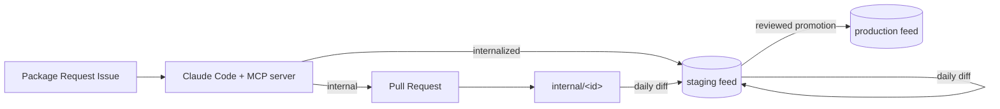

# chocolatey-packages

Enterprise lifecycle management for Chocolatey packages — internalized from the Chocolatey Community Repository, and internally authored — with no manual manifest-tracking: package staleness is answered by diffing feed contents directly, new packages are requested through a GitHub Issue that an AI agent turns into a bootstrap push or a PR, and everything converges on the same scan → promote pipeline before reaching production.

See **[docs/architecture.md](docs/architecture.md)** for the full design, including what's already validated, what's still open, and how to test the whole thing locally without a real Nexus instance.

## How it works

- **Internalizing a Community package**: one-time bootstrap (`internalize-community-package.yml`, or via the Issue → agent flow below) downloads, internalizes, scans (Windows Defender + Grype), and pushes it to the staging feed. From then on, `refresh-internalized-packages.yml` runs daily, diffing staging against the Community Repository and re-internalizing anything newer — no manifest file to keep in sync, no PR to merge.
- **Internal packages** are [AU](https://github.com/majkinetor/AU) (Chocolatey Automatic Packages): each one checks its own vendor's release page directly via `update.ps1`. `update-internal-packages.yml` runs the same daily-diff model against them; `test-internal-packages.yml` validates changes on a PR without ever touching a feed.
- **Promotion to production**: `propose-package-promotion.yml` diffs staging against production and proposes a PR listing what's newer in staging; merging that PR is the human approval, and `promote-approved-packages.yml` then re-scans and pushes each entry on to production. (An Environment with required reviewers was the original plan, but GitHub restricts that protection rule to organization-owned repos — this one's owned by a personal account, so the PR itself is the gate.)
- **Requesting a new package** you haven't touched before: open an Issue from the `package-request` template. `handle-package-request.yml` runs an AI agent (Claude Code, headless) against a small MCP server (`mcp-server/`) exposing fourteen narrowly-scoped tools — it either bootstraps a Community package straight to staging, or scaffolds a new internal AU package (informed by a small knowledge base of vendor-specific quirks it can also add to, human-reviewed via the same PR) and opens a PR for a human to review. The agent never touches production and never merges its own PR. When no known source has the silent-install switch, it can download the installer and read it statically (`get_installer_signals`) for a framework-typical candidate — but that candidate is flagged, not trusted, until a human confirms it locally in an isolated Windows Sandbox (`scripts/New-SilentTestKit.ps1`, [docs/silent-switch-verification.md](docs/silent-switch-verification.md)) before approving the PR.
- **Finding candidates before anyone asks**: `prospect-community-versions.yml` runs hourly until it's covered evergreen-api's full app index at least once (then worth dialing back to daily), comparing a batch of well-known apps' real current versions (from evergreen-api) against a matching Community package's version and how long ago it was published — surfacing exactly the situation that already motivates every internal package built so far (Community lagging the vendor) before a human has to notice it by hand. `prospect-community-staleness.yml` complements it with a much broader, weaker-signal sweep of the *entire* Community Repository (~11,654 unique packages) by `Published` date alone. `prospect-packaging-opportunities.yml` looks the other way entirely — daily, checking whether real, recently-popular open-source software on GitHub (created in the last year, 300+ stars, a real Windows installer in its releases) has no Chocolatey package at all yet. A flagged candidate can become an internal AU package, or `Draft-CommunityPackageUpdate.ps1` can fetch what's needed to contribute the fix back to an existing package's own maintainer — drafted locally only, never auto-submitted; see [prospecting/README.md](prospecting/README.md).



## Layout

| Path | What's there |
|---|---|
| [docs/architecture.md](docs/architecture.md) | The full design — start here |
| [docs/silent-switch-verification.md](docs/silent-switch-verification.md) | How to confirm a candidate silent-install switch is real before trusting it — exit codes, the pre-approval checklist, and the sandboxed test kit |
| [internal/](internal/) | AU-based internally authored packages ([internal/README.md](internal/README.md)) |
| [internalized/](internalized/) | Community packages internalized for offline install — no manifest, just a README ([internalized/README.md](internalized/README.md)) |
| [.github/ISSUE_TEMPLATE/package-request.yml](.github/ISSUE_TEMPLATE/package-request.yml) | The request form that triggers the agent-driven creation flow |
| [.github/workflows/](.github/workflows/) | Every workflow described above |
| [scripts/](scripts/) | Operational PowerShell: linting, scanning, the diff-based internalize/promote logic |
| [mcp-server/](mcp-server/) | The MCP server behind the Issue-triggered creation flow ([mcp-server/README.md](mcp-server/README.md)) |
| [prospecting/](prospecting/) | Proactive version/staleness discovery against evergreen-api ([prospecting/README.md](prospecting/README.md)) |
| [update_all.ps1](update_all.ps1) / [test_all.ps1](test_all.ps1) | AU's repo-root drivers for `internal/` packages |

## Status

The pipeline described above is **implemented and has been validated end-to-end as real GitHub Actions runs** (`internalize-community-package.yml`, `refresh-internalized-packages.yml`, and the now-retired direct-promote workflow it superseded have each completed successfully on the self-hosted runner), plus the MCP server and a full headless-agent run against it. Three real bugs and one runner-environment issue were found and fixed by that testing, not just by reading the code — see [docs/architecture.md § 14](docs/architecture.md#14-implementation-status--roadmap) for the details and for what's still open (a real Nexus instance, exercising the new PR-gated promotion flow end-to-end, a real internal AU package to test against, and a few deliberately-scoped gaps against the original design).

## Testing without a real Nexus

Nothing in this pipeline calls a Nexus-specific API — every script talks plain `choco search`/`download`/`push`. That means a throwaway NuGet-compatible feed in Docker exercises the exact same code paths:

```
docker run -d --name choco-test-staging -p 5555:8080 -e ApiKey=test-key bagetter/bagetter:latest
docker run -d --name choco-test-prod    -p 5556:8080 -e ApiKey=test-key-prod bagetter/bagetter:latest
```

Point `STAGING_FEED_URL`/`PRODUCTION_FEED_URL` at `http://localhost:5555/v3/index.json` / `http://localhost:5556/v3/index.json`. See [docs/architecture.md § 14](docs/architecture.md#14-implementation-status--roadmap) for the full recipe.

### Testing (or demoing) the Nexus generic path

The paywalled-package mechanism (`scripts/Get-NexusGenericLatestAsset.ps1`, `docs/architecture.md § 6.8`) needs a real Nexus, not a NuGet-compatible stand-in — its own generic (raw) repository format and Search Assets API are Nexus-specific. Sonatype's own image stands one up in a couple of minutes:

```
docker run -d --name nexus-test -p 8082:8081 sonatype/nexus3:latest
# Nexus takes ~60-90s to finish starting; poll until this returns 200:
curl -s -o /dev/null -w "%{http_code}" http://localhost:8082/service/rest/v1/status

# Initial admin password:
docker exec nexus-test cat /nexus-data/admin.password

# Accept the EULA (required before anything else works), create a generic
# hosted repo, then upload a real file to it -- replace ADMIN_PW below:
curl -s -u admin:ADMIN_PW http://localhost:8082/service/rest/v1/system/eula \
  | node -e "let d='';process.stdin.on('data',c=>d+=c);process.stdin.on('end',()=>{const j=JSON.parse(d);j.accepted=true;console.log(JSON.stringify(j));})" \
  > eula-payload.json
curl -s -u admin:ADMIN_PW -X POST http://localhost:8082/service/rest/v1/system/eula \
  -H "Content-Type: application/json" --data-binary @eula-payload.json

curl -s -u admin:ADMIN_PW -X POST http://localhost:8082/service/rest/v1/repositories/raw/hosted \
  -H "Content-Type: application/json" \
  -d '{"name":"generic-hosted","online":true,"storage":{"blobStoreName":"default","strictContentTypeValidation":true,"writePolicy":"ALLOW"}}'

curl -s -u admin:ADMIN_PW --upload-file ./some-real-installer.exe \
  http://localhost:8082/repository/generic-hosted/acme/my-app/my-app-1.0.0.exe
```

Then point `scaffold_internal_package`'s `nexus_generic_base_url`/`nexus_generic_repository`/`nexus_generic_path_prefix` at `http://localhost:8082` / `generic-hosted` / `acme/my-app/`, and set `NEXUS_GENERIC_READ_TOKEN=admin:ADMIN_PW` for `Get-NexusGenericLatestAsset.ps1` to use.

**For the actual install step to work too** (not just the version/checksum lookup), the repository also needs to be *readable* by whatever downloads the file — `Get-ChocolateyWebFile` sends no credential of its own. The tested, narrowly-scoped way to allow that (verified for real: a second, unrelated repo created purely to test isolation stayed correctly denied while this one succeeded):

```
# 1. Enable anonymous access at all (system-wide toggle):
curl -s -u admin:ADMIN_PW -X PUT http://localhost:8082/service/rest/v1/security/anonymous \
  -H "Content-Type: application/json" -d '{"enabled":true,"userId":"anonymous","realmName":"NexusAuthorizingRealm"}'

# 2. Do NOT leave the anonymous user on the default 'nx-anonymous' role --
#    it grants read across every repository in the instance. Give it a
#    role scoped to just the one repository instead:
curl -s -u admin:ADMIN_PW -X POST http://localhost:8082/service/rest/v1/security/roles \
  -H "Content-Type: application/json" \
  -d '{"id":"generic-hosted-anonymous-read","name":"generic-hosted-anonymous-read","privileges":["nx-repository-view-raw-generic-hosted-read","nx-repository-view-raw-generic-hosted-browse"]}'

curl -s -u admin:ADMIN_PW -X PUT http://localhost:8082/service/rest/v1/security/users/anonymous \
  -H "Content-Type: application/json" \
  -d '{"userId":"anonymous","firstName":"Anonymous","lastName":"User","emailAddress":"anonymous@example.org","source":"default","status":"active","roles":["generic-hosted-anonymous-read"]}'
```

See [docs/architecture.md § 6.8](docs/architecture.md#68-mcp-server--agent-driven-package-creation) for what real testing against this exact setup found (two real bugs in `Get-NexusGenericLatestAsset.ps1`, both fixed, and this anonymous-read scoping requirement).
