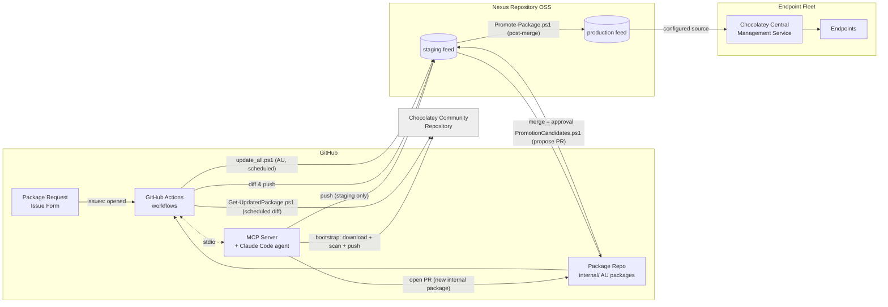
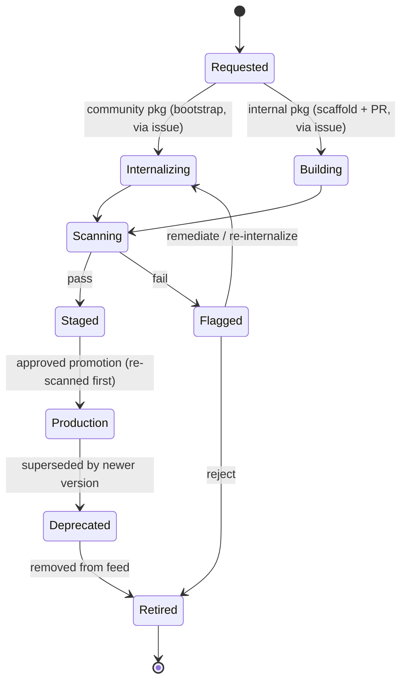

# Enterprise Chocolatey Package Lifecycle Management — Architecture Design

**Status:** Core pipeline implemented and tested (Parts 1–3 below); a full visibility dashboard and ephemeral-runner automation remain open.
**Scope:** On-premise lifecycle management for Chocolatey packages (Community-internalized and internally authored), driven by GitHub Actions, an issue-triggered creation flow backed by an MCP server, and Chocolatey's AU (Automatic Packages) module — hosted on Nexus Repository OSS, with Chocolatey for Business (C4B) for endpoint deployment and reporting.

---

## 1. Purpose & Scope

This document describes an architecture for managing the full lifecycle of Chocolatey packages inside the enterprise: pulling in packages from the Chocolatey Community Repository and internalizing them (so installers never depend on the public internet), authoring and maintaining internal-only packages, and getting both kinds of packages safely into production feeds that endpoints pull from. The design assumes Chocolatey for Business is already licensed, and uses Nexus Repository OSS as the system of record for built packages.

The two package types are treated as the same supply chain with different entry points: internalization is the "ingest from the internet" entry point, and the internal package build is the "author from scratch" entry point. Both converge on the same scan and promote stages. Unlike the original design of this document, staleness is no longer tracked through a reviewed manifest file — it's determined by directly diffing feed contents against the upstream source (Community Repository, or each internal package's own vendor release page), and a new package is requested through a GitHub Issue that an AI agent turns into a bootstrap push or a PR.

## 2. Goals

- Let a packager request a new package — internalized from the Community Repository, or an internal package tracking its own vendor's releases — by opening a GitHub Issue from a form, without hand-authoring nuspec/manifest files themselves. A full catalog/deployment-visibility dashboard (Section 10) remains a future enhancement, not required for the request/creation flow itself.
- Make GitHub the system of record for package definitions (nuspec, install scripts, AU update scripts) and GitHub Actions the execution engine for internalize, build, scan, refresh, and promote steps.
- Keep Nexus as the only thing endpoints ever talk to — no direct internet access to community.chocolatey.org from production endpoints.
- Provide vulnerability scanning before anything reaches staging, and a human-approved promotion gate before anything reaches production.
- Use Chocolatey Central Management (CCM) for what it's good at — endpoint inventory, deployment plans, install/upgrade/uninstall orchestration, and compliance reporting — rather than trying to make it do package-supply-chain governance it wasn't built for.
- Keep already-onboarded packages current automatically: internalized packages are re-checked against the Community Repository on a schedule, and internal (AU) packages check their own vendor's release page on a schedule — neither needs a packager to notice a new upstream version manually.

## 3. Non-Goals

This design does not cover replacing Nexus, or replacing CCM's endpoint management capabilities with custom tooling. It also does not cover non-Windows package ecosystems (npm, NuGet for .NET libraries, etc.) even if they happen to live in the same artifact repository — those are out of scope and assumed to already have their own governance.

## 4. Key Assumptions

Chocolatey for Business is licensed (Package Internalizer, Package Builder, Central Management Service/Website). **Nexus Repository OSS** is the artifact repository — no Nexus IQ license is assumed, so vulnerability scanning is done with Grype rather than Nexus's own scanning integration. GitHub (cloud or Enterprise Server) is the version control and CI/CD platform. Self-hosted Windows runners are required, since `choco` internalization and AU both require Windows; they additionally need Node.js and the Claude Code CLI (`claude`) installed for the issue-triggered creation flow (Section 6.8), and an `ANTHROPIC_API_KEY` secret configured for that workflow.

## 5. System Overview



GitHub Actions is the only thing that writes to the feeds. CCM is the only thing that talks to endpoints. The MCP server never writes anywhere on its own — every write it makes (a push to staging, a local file, a PR) goes through one of a small number of narrowly-scoped tools (four of its fifteen, Section 6.8), each a thin wrapper around a script that already existed independently of the agent. (`download_installer_file`'s write is a fifth, but scoped to the OS temp directory only — a scratch file for `get_installer_signals` to read, never anything tracked or part of the audit trail.) This separation keeps each system doing one job and keeps the audit trail in GitHub Actions run history and PR history.

## 6. Component Architecture

### 6.1 Source Control Layer

A single monorepo, `chocolatey-packages`, with a top-level split between `internal/<package-id>/` and `internalized/`.

**`internal/<package-id>/`** — each internal package is an [AU](https://github.com/majkinetor/AU) (Chocolatey Automatic Packages) package: it checks its own release source directly and updates itself, rather than being hand-maintained.

```
internal/<package-id>/
├── <package-id>.nuspec       # filename MUST match the folder name — AU
│                              # discovers packages by nuspec filename, not
│                              # just the <id> element (confirmed by testing)
├── metadata.yml               # owner/lifecycle fields AU doesn't track
├── update.ps1                 # au_GetLatest / au_SearchReplace hooks
└── tools/
    └── chocolateyinstall.ps1   # url/checksum left empty — filled in by
                                 # au_SearchReplace at update time
```

**`internalized/`** — no manifest file. Presence in the **staging feed** is the record of what's currently onboarded; a scheduled job (Section 9.2) diffs staging against the Community Repository directly rather than reading a tracked file. This replaced an earlier design that used a per-package `internalize.yml` manifest requiring a PR to bump a pinned version — the manifest added a layer of tracked state that could drift from what was actually in the feed, so it was dropped in favor of asking the feed itself.

CODEOWNERS at the folder level lets you require the right reviewer per internal package without splitting repos.

### 6.2 Request & Creation Layer

The entry point for "onboard a package I haven't touched before" is a **GitHub Issue Form** (`.github/ISSUE_TEMPLATE/package-request.yml`): package type (internalized vs. internal), package id, source URL (for internal packages), owner team, notes. Opening it triggers `handle-package-request.yml` (Section 6.8), which runs an AI agent against a **narrowly-scoped MCP server** to do the actual work:

- **Internalized package requested** → the agent calls `bootstrap_internalize_package`, which downloads, internalizes, scans, and pushes straight to the **staging feed only**. There's nothing to review in a PR here, since internalized packages have no tracked manifest — the scan result and the push itself are the audit trail. `refresh-internalized-packages.yml` (Section 9.2) takes over keeping it current from that point on, without the agent being involved again.
- **Internal package requested** → the agent scaffolds a new `internal/<id>/` folder from a template, lints it, and opens a PR. A human still reviews and merges — `update.ps1`'s `au_GetLatest` almost always needs a person to verify the scraping logic actually matches the vendor's real release page before it's trusted to run unattended.

A full catalog/approval-queue/deployment-visibility dashboard (as originally sketched — Section 10) remains a reasonable future addition once this request flow is proven out, but isn't required for it to work: GitHub's own Issues, PRs, and Environment approval UI already provide the request/review/approve surface.

### 6.3 CI/CD Layer — GitHub Actions

This is the workhorse. All package-producing and package-promoting operations happen here, on self-hosted Windows runners. See Section 9 for the individual workflows.

### 6.4 Artifact Repository Layer — Nexus Repository OSS

Nexus hosts two NuGet-format hosted repositories: a staging repo that every successful internalize/refresh/AU-update pushes to, and a production repo that only receives packages via the PR-gated promotion workflow. Nexus OSS has no native package-promotion feature (that's a ProGet-specific capability this design originally left open) and no built-in vulnerability scanning (that's a Nexus IQ feature, not licensed here) — promotion here is a scripted diff-and-copy (`Get-PromotionCandidates.ps1` proposes, `Promote-Package.ps1` executes after a human merges; Section 9.4) with scanning done by Grype instead (Section 6.7). The production repo is the *only* source endpoints are configured to pull from — never staging, never the public Community feed.

### 6.5 Endpoint Management Layer — Chocolatey Central Management

CCM (Central Management Service + Website + SQL Server backend) continues to do what it does today: maintain endpoint inventory, run deployment plans, push install/upgrade/uninstall jobs to groups of machines, and report on what's installed where. Its agents/endpoints are configured to use the Nexus production feed as their Chocolatey source instead of the public Community repository.

### 6.6 Runner Infrastructure

A pool of self-hosted Windows runners. Today this is a single runner (labels `self-hosted, windows, choco-internalize`) serving every workflow; the original design called for splitting it into a `choco-internalize` pool (network access to community.chocolatey.org) and a general pool (no such access, tighter network segmentation) once volume justifies the extra machine to manage — that split is still an open item (Section 15), not yet built.

Prerequisites installed on the runner: `choco` (C4B-licensed), `git`, `gh`, `grype`, the `AU` PowerShell module, and — new for the issue-triggered creation flow — **Node.js** and the **Claude Code CLI** (`claude`), both on `PATH`. Ideally the runner is ephemeral (re-imaged or recreated per job) given internalize jobs download and execute arbitrary third-party installers; that automation isn't built yet either (Section 15).

### 6.7 Security & Scanning Layer

Every internalized, refreshed, or freshly built package passes through `scripts/scan-package.ps1` before it's eligible for promotion: an AV scan via Windows Defender (`MpCmdRun.exe`) and a CVE/vulnerability scan via [Grype](https://github.com/anchore/grype) against the package's extracted contents, failing on any match at or above a configurable severity (default `High`). This runs at internalize/bootstrap time, at AU update time, and again just before each package is promoted from staging to production (Section 9.4) — but **not** on a recurring basis against packages that are already sitting in production. The original design called for a periodic re-scan of the whole production feed to catch newly disclosed CVEs against software that hasn't itself changed; that periodic re-scan was never built. This is a known gap — see Section 9.5 and Section 15.

### 6.8 MCP Server & Agent-Driven Package Creation

`mcp-server/` is a small Node.js server ([`@modelcontextprotocol/sdk`](https://github.com/modelcontextprotocol/typescript-sdk)) exposing fifteen tools. Each is a thin wrapper around an existing script, a public API, or a small, auditable git/file operation — no package-management logic is reimplemented in the server itself:

| Tool | Wraps | Write scope |
|---|---|---|
| `search_community_package` | `choco search --exact --limit-output` | none (read-only) |
| `lint_package` | `scripts/lint-nuspec.ps1` | none (read-only) |
| `search_evergreen_app` | [evergreen-api.stealthpuppy.com](https://eucpilots.com/evergreen/api/) `/apps` index | none (read-only) |
| `get_evergreen_app_info` | evergreen-api `/app/{name}` | none (read-only) |
| `search_silent_install_switch` | best-effort scrape of one [manageengine.com](https://www.manageengine.com/products/desktop-central/software-installation) catalog snapshot page — not exhaustive; a miss doesn't mean no switch exists | none (read-only) |
| `get_community_package_tools` | downloads a Community package (no internalize, no push) and returns its real `tools/chocolateyInstall.ps1`/`chocolateyUninstall.ps1` plus a best-effort `detectedSilentArgs` extracted from it; tries `<id>.install` automatically if the bare id is a tools-less metapackage, and follows an `Install-VirtualPackage` redirect (preferring whichever target actually yields a `detectedSilentArgs`) if the bare id's own script is just that | none (read-only) |
| `get_winget_package_manifest` | resolves a package (exact winget id, or a search term with exactly one confident match) against Microsoft's winget-pkgs repo and returns its real `InstallerUrl`/`InstallerSha256`/`InstallerSwitches.Silent` per architecture, straight from structured YAML | none (read-only) |
| `download_installer_file` | downloads a direct installer URL (a request's own `source_url`, or one another tool returned) to a local temp path | writes only inside the OS temp directory |
| `get_installer_signals` | `scripts/Get-InstallerSignals.ps1` — reads (never executes) a downloaded MSI's real Property table via the Windows Installer COM API, or an EXE's embedded strings matched against known installer-framework fingerprints (NSIS, Inno Setup, InstallShield, WiX Burn, InstallAware, Squirrel, Advanced Installer), reporting a framework-typical candidate switch — a starting point, not a confirmed one (Section 6.9) | none (read-only) |
| `inspect_download_page` | fetches a vendor download/release page's real static HTML (no JS execution) and returns every `.exe`/`.msi`/`.msix`/`.msixbundle`/`.zip` link plus a stripped text excerpt — lets the agent infer a real scrape-based `au_GetLatest` (via `scaffold_internal_package`'s `au_getlatest_page_url`/`au_getlatest_link_pattern`) instead of falling back to the generic "filename starts with the package id" placeholder, for a vendor with no evergreen-api coverage and no GitHub Releases API. A page whose real links only render via client-side JavaScript comes back with zero matches — a genuine limitation, same class as the GitHub-HTML-scrape approach `buildGitHubReleasesGetLatest` replaced (Section 15) | none (read-only) |
| `lookup_package_knowledge` | reads `knowledge/<vendor>.yml`, including its `silent_args`/`source_url` fields if recorded | none (read-only) |
| `scaffold_internal_package` | copies `internal/_template/`, fills in placeholders; given `evergreen_app_name`, generates a real `au_GetLatest` instead of a generic guess; given `vendor`, auto-fills `silent_args`/`source_url`/`product_description` from `knowledge/<vendor>.yml` when not passed explicitly; also seeds the nuspec's `<title>`/`<authors>`/`<projectUrl>`/`<tags>` from evergreen's own app index (or explicit `title`/`vendor_name` params) instead of the bare package id; given all three `nexus_generic_*` params, generates an `au_GetLatest` for paywalled software instead (below); given `au_getlatest_page_url`+`au_getlatest_link_pattern` (from reading `inspect_download_page`'s real output), generates a scrape-based `au_GetLatest` against that vendor page instead of the generic placeholder; given `package_kind: 'portable'`, generates a `Get-ChocolateyWebFile`-based install script for a standalone CLI binary instead of an installer-based one (below) | local working tree only |
| `write_package_knowledge` | writes/merges `knowledge/<vendor>.yml`, standardly including `silent_args`/`source_url` when found | local working tree only |
| `bootstrap_internalize_package` | download → `scan-package.ps1` → push | **staging feed only** — refuses to run if `STAGING_FEED_URL`/`STAGING_API_KEY` aren't set, and never receives production credentials |
| `open_pull_request` | `git`/`gh` | opens a PR against `main`; never merges |

**`knowledge/<vendor>.yml`** (Section 8) is a small, human-reviewed knowledge base of facts already confirmed about a vendor's packages — checksum field name, image-type/architecture default, version-format quirks, known-good silent-install switch — so the next package from the same vendor doesn't rediscover the same quirk by trial and error. It exists because that's exactly what happened twice already in this section: `temurin17` and `temurin25` each needed the same kind of vendor-specific debugging (checksum field name, `jdk`/`jre` disambiguation, version sanitization) independently, with nothing carrying the finding from one to the next. `lookup_package_knowledge` is meant to be called before scaffolding; `write_package_knowledge` only ever writes to the local working tree, the same as `scaffold_internal_package` — it never commits or pushes on its own. The agent is expected to include any `knowledge/` file it wrote in the same `open_pull_request` call as the package it came from, so a human reviews a learned or corrected fact exactly like a code change, in the same PR, rather than the agent silently accumulating unreviewed beliefs about a vendor over time.

The knowledge base originally only got read/written for `au_GetLatest`-adjacent facts, though — `silent_args` and `source_url` were nominally in scope (both tools' descriptions already mentioned "silent-install switch") but had no standard field name and, tellingly, `temurin25`'s real recorded entry never ended up with a `silent_args` value even though the agent that produced it must have found a real one. Two things closed that gap: `scaffold_internal_package` gained a `vendor` parameter that reads `knowledge/<vendor>.yml`'s `silent_args`/`source_url` itself, the same way it already auto-reads evergreen's app index — an explicit parameter still always wins, but nothing has to remember to look the knowledge base up and thread the result through by hand anymore. `get_community_package_tools` also now returns a best-effort `detectedSilentArgs` extracted directly from the real script it fetches, instead of leaving the agent to spot a `silentArgs = '...'` line in raw file text — confirmed by testing against a real package (7zip.install's `/S`). Verified end-to-end with a throwaway vendor/package: writing `silent_args`/`source_url` via `write_package_knowledge` and then scaffolding with only `vendor` set (no explicit `silent_args`/`source_url`) produced a `chocolateyinstall.ps1` with the knowledge base's exact value already filled in. `knowledge/adoptium.yml` was also backfilled with `temurin17`'s real, already-reviewed silent-install switch (`/qn /norestart`, standard for its MSI-based installer) — the first real data this field has held, not just the mechanism to hold it.

The two evergreen-api tools and `scaffold_internal_package`'s use of them were added after real testing on `temurin17` showed how much better a scaffolded AU package is when it starts from a real, working `au_GetLatest` instead of a CHANGE_ME placeholder. `search_silent_install_switch` was added for the same reason for `silentArgs`, with an explicit caveat baked into the tool's own description: ManageEngine has no search API, so this only scans one non-paginated catalog page — good enough to often help, not something to treat as authoritative when it comes up empty.

`get_community_package_tools` covers the common case those two miss: an internal package is usually being made *because* a Community equivalent already exists but lags the vendor's own release cadence (`temurin17` tracking Eclipse Adoptium directly rather than Community's own `temurin17`, which was the original motivating case for internal packages at all — Section 6.1) — and that existing Community package's own `chocolateyInstall.ps1` is real, working, community-vetted install logic, generally a better source for `silentArgs`/`softwareName`/`fileType` than a guess or a best-effort catalog scrape. Confirmed by testing against a real package: many Community packages split the actual install logic into a `<id>.install` variant — the bare id (e.g. `7zip`) is just a metapackage with no `tools/` folder at all, while `7zip.install` has the real scripts — so the tool tries that variant automatically rather than reporting a false negative for every split package.

A first real test against a genuinely new package (`notepadplusplus`, never used in any earlier test) found a second, subtler version of the same problem: its `tools/chocolateyInstall.ps1` isn't missing, but its entire content is one line, `Install-VirtualPackage 'notepadplusplus.commandline' 'notepadplusplus.install'` — a real Chocolatey convention for a metapackage that points at whichever package(s) actually install something, rather than having no `tools/` folder at all. The original version of this tool treated that as "found" (the file exists and is non-empty) and would have handed back a redirect comment instead of anything usable. Fixed to detect this and follow every named target, in order, before falling back to the `.install` naming guess — the script's own redirect is more authoritative than that convention. A further refinement, also found by testing this same real package: `notepadplusplus` redirects to *two* real targets, and the first one found (`notepadplusplus.commandline`) turned out to have real but unhelpfully generic install logic with no recognizable silent switch, while the second (`notepadplusplus.install`) had exactly the `/S` this tool exists to find — so it no longer stops at the first structurally-valid candidate, it keeps exploring (bounded, to guard against a pathological redirect chain) and prefers whichever one actually yields a `detectedSilentArgs`, reporting any other valid candidate found alongside it rather than silently discarding it.

The same real-package test (`notepadplusplus`/`Notepad++`) caught a bug in `get_winget_package_manifest` too: its winget id is literally `Notepad++.Notepad++`, and the pattern used both to validate a `winget search` result row's id column and to recognize an already-exact id only allowed letters, digits, dots, and hyphens — a `+` character silently failed the match, so a real, unambiguous search result was dropped as if it didn't exist. Fixed by broadening the pattern (still requiring at least one dot, still Publisher.Package-shaped, just not assuming what characters a real segment can contain) and exporting a single definition from `lib/winget.js` for both call sites to share, rather than two copies that could drift apart the same way again.

The same reasoning extends to the rest of the nuspec: `search_evergreen_app`'s underlying `/apps` index carries an `Application` (human-friendly name, e.g. "Adoptium Temurin 25" for `AdoptiumTemurin25`) and `Link` (homepage) field per entry — confirmed by testing against a real entry — that were being fetched and then thrown away, leaving `<title>` as the bare package id and `<projectUrl>` empty even for a well-supported app. `scaffold_internal_package` now looks this entry up itself (given `evergreen_app_name`) and uses it to seed `<title>`, `<authors>`, `<projectUrl>`, and an extra searchable `<tags>` entry (plus the evergreen image type, e.g. `jdk`, when relevant) — with explicit `title`/`vendor_name`/`source_url` parameters (also exposed as optional Issue Form fields) always taking priority, and a prettified package id as the last-resort `<title>` fallback for packages with no evergreen support at all. `<packageSourceUrl>` is always set to this repo's own `internal/<id>/` path, needing no input at all. `<authors>` deliberately never falls back to `owner_team` silently without saying so in the tool's result — that field means the software's real publisher, not who owns the internal package (`<owners>`, which does use `owner_team`), and conflating the two would be a wrong, if plausible-looking, nuspec.

Before submitting a `temurin25` request (the same situation as `temurin17` — supported by evergreen, but with a different real shape), a dry run against evergreen's real data for it surfaced three more issues, all fixed before that request went in:

- Some apps (JDKs especially) publish more than one x64 variant distinguished only by `ImageType` (`AdoptiumTemurin25` has both a `jre` and a `jdk` x64 variant) — `pickPreferredVariant()` now defaults to `jdk` over `jre` when both exist, with an optional `evergreen_image_type` override, and bakes that same condition into the *generated* `au_GetLatest` filter so it disambiguates correctly on every future run too, not just at scaffold time.
- The checksum field name varies per app (`Sha256` for `7zip`, `Checksum` for `AdoptiumTemurin25`) — the generated code now checks both instead of hardcoding one and silently getting an empty checksum.
- Evergreen's `Version` can carry more numeric segments than NuGet/choco's 4-segment limit even after stripping `+` build-metadata syntax (proven fine for `temurin17`'s version shape, not for `temurin25`'s) — the generated `au_GetLatest` now validates the sanitized version and throws a clear, actionable error rather than producing an invalid version silently. Deliberately not auto-truncated: dropping the extra segment would lose real build-number information that can matter for correctly detecting a new release later, so a human decision belongs here.

Testing beyond the JDK family (`Alacritty`, `AkeoRufus`/Rufus — picked specifically to diversify past what temurin17/temurin25 already exercised) surfaced three more real gaps in `pickPreferredVariant`, none related to `ImageType`:

- Some apps publish both a real installer *and* a portable single-binary variant side by side, distinguished by `InstallerType` (`Alacritty`: an `.msi` tagged `Default`, and a portable `.exe` tagged `Portable` — with Portable listed *first* in evergreen's own array). `pickPreferredVariant` picked whichever came first, blind to which one actually matched the `package_kind` ('installer' by default) being scaffolded — for Alacritty that meant handing an installer-kind package a binary with no install wizard at all, the same class of bug already found and fixed for CodeGraphContext (Section 6.8's `package_kind: 'portable'`), resurfacing here through the evergreen path instead of a prospecting one. Fixed by filtering on `InstallerType` against the requested `package_kind` too, with the same "bake it into the generated filter, not just the seed" reasoning as the `ImageType` fix.
- Fixing the above then exposed a second bug it had been masking: the selected variant's real file type (`Type`: `exe`/`msi`) was never propagated into `chocolateyinstall.ps1` at all — `fileType` and `silentArgs` stayed at the template's `exe`/`'/S'` defaults regardless of what was actually selected. For Alacritty's real `.msi`, that would have shipped a package trying to run an MSI as if it were a self-silencing EXE. Fixed by propagating the selected variant's `Type` into `fileType`, and defaulting `silentArgs` to `/qn /norestart` (the standard MSI switch) instead of `/S` when no better source (explicit, knowledge base) was found for an `.msi`.
- Some apps publish no `x64` variant at all (`AkeoRufus`: only `ARM64` and several `x86` builds) — the original fallback ("x64, else every architecture unfiltered") would silently hand back whichever architecture happened to be listed first once x64 was absent, which for Rufus was the `ARM64` build — useless on the Intel/AMD endpoints most fleets actually have. Fixed by trying `x64`, then `x86`, before falling through to whatever's left, since `x86` is the much safer broad-compatibility fallback.

All three verified end-to-end, not just structurally: scaffolded both apps for real, `lint_package` passed both, and running each package's real `update.ps1` locally (AU's own force-update, no push) correctly resolved the real current version, the *installer* MSI URL for Alacritty (not the portable exe), the *x86* build for Rufus (not ARM64), a real checksum for each, and packed a real `.nupkg` for both.

That same `temurin25` testing round also caught a more fundamental bug in `scaffold_internal_package` itself: `replaceInFile` used `content.replace(pattern, generatedString)` — and JavaScript's `String.replace()` treats a few `$`-prefixed sequences in a *string* replacement as special substitution patterns (`$&`, `` $` ``, `$'`, `$1`-`$99`, `$$`), not literal text. The generated `au_GetLatest` body legitimately contains `$` for both PowerShell variable sigils and regex anchors, and one such `$'` sequence matched "insert everything after the match," splicing the rest of the file into the middle of the generated function. Fixed by always passing a replacer *function* (`() => replacement`) instead of the bare string, which is a general fix for every caller of `replaceInFile`, not just the evergreen-seeded path.

`.github/workflows/handle-package-request.yml` runs the agent (Claude Code, headless: `claude -p ... --mcp-config mcp-server/mcp-config.json --strict-mcp-config --allowedTools <exactly these 15 tools> --permission-mode bypassPermissions --output-format json`) against the issue body, and posts the agent's one-line result back as an issue comment. Two things worth calling out about how untrusted content is handled here: the issue body (and later, the agent's own response) are passed into the workflow via `env:` variables and referenced from the PowerShell script, never spliced directly into the `run:` block's script text — doing the latter is a real script-injection vector in GitHub Actions, since `${{ }}` expressions are substituted as literal text into the script *before* the shell parses it. `--strict-mcp-config` plus the explicit `--allowedTools` list also means the agent has no access to any tool beyond these fifteen, regardless of what else might be configured on the runner.

**Static installer analysis, and where it stops.** `get_winget_package_manifest`/`get_community_package_tools`/`search_silent_install_switch` all either return a switch someone else already deployed (winget-pkgs, a real Community script) or admit they found nothing — none of them can help when a package genuinely has no coverage anywhere. `get_installer_signals` (`scripts/Get-InstallerSignals.ps1`) closes part of that gap by reading the installer's own bytes instead: an MSI's Property table via the Windows Installer COM API's read-only `OpenDatabase` mode (never runs the install sequence), or — for an EXE, which has no equivalent structured format — a scan of its embedded ASCII/Unicode strings against known installer-framework fingerprints. Verified against real installers cached on disk: a genuine Squirrel-built EXE, a genuine NSIS-built EXE, and a real MSI (a cached Office component) all returned correct signals. Real testing also caught a coverage gap before it shipped — a real Advanced Installer-built EXE (Caphyon's DriverFusion) matched none of the frameworks initially checked for (WiX, InstallShield, Inno Setup, NSIS, InstallAware, Squirrel), silently falling through to "no framework detected" despite the binary plainly containing its own vendor name — fixed by adding Advanced Installer's fingerprint, which then correctly surfaced that same installer's real, documented switches (`/exenoui`, `/exelog`, `/forcerestart`, among others) as `NotableSwitchLikeStrings`. That same field needed a second real fix: an initial shape-only filter (leading `/`/`-`, then letters/digits) matched mostly noise from compressed binary regions — random fragments like `-cywcd` that happen to fit the shape — cut down significantly (without losing the real Advanced Installer switches above) by requiring the token be consistently all-upper or all-lower with no digits, matching how every real switch example in this space is actually written.

`get_installer_signals` needs a local file to read, and nothing upstream of it in the fallback chain ever downloads one — `download_installer_file` is the missing link, a narrowly-scoped fetch-to-temp-path tool (writes only inside the OS temp directory, reads only the single URL given) that exists specifically to make `get_installer_signals` reachable, not as a general-purpose download capability. Verified for real, chained end-to-end: `download_installer_file` against 7-Zip's own real installer URL, piped straight into `get_installer_signals` — 7-Zip's installer correctly matched none of the known frameworks (it's a proprietary self-extracting archive, not built with any of them), an honest "no signal" rather than a wrong guess, which is the behavior this tool is meant to have when a framework genuinely isn't one of the ones it knows.

Both are deliberately headless-safe (no execution, no GUI, no elevation) and run in `handle-package-request.yml` like every other tool — unlike `scripts/New-SilentTestKit.ps1` (Section 6.10), which actually runs the candidate switch and therefore can't. `get_installer_signals`'s own result is explicitly a framework-typical guess, not a confirmed switch, and the agent is told to say so in the PR body rather than presenting it with the same confidence as a winget/Community-sourced value.

**Paywalled software: mirroring a human's own download instead of scraping a page.** Every `au_GetLatest` above assumes a public, scriptable release source — a vendor page, evergreen-api, winget-pkgs. Some internal software genuinely has none: it's behind a paid login this automation must never hold credentials for, the same reasoning already applied to every other credential-scoping decision in this design (Section 12). The supported path for that case: a human logs into the vendor's own portal, downloads the release themselves, and uploads it to a fixed path in a Nexus generic (raw-format) hosted repository — `scaffold_internal_package`'s `nexus_generic_base_url`/`nexus_generic_repository`/`nexus_generic_path_prefix` params (mutually exclusive with, and taking priority over, `evergreen_app_name` if both were somehow given) generate an `au_GetLatest` that calls `scripts/Get-NexusGenericLatestAsset.ps1` instead of scraping anything — it queries Nexus's own Search Assets API for whatever's already been uploaded under that path, parses a version out of the newest matching filename (numeric segment-by-segment comparison, not `[version]`'s 4-segment-limited or a naive lexicographic one — confirmed by a real unit test that `1.10.0` sorts after `1.9.9` correctly), and returns that asset's own `downloadUrl`/`checksum.sha256` straight from Nexus's response — no second download-then-hash step needed, since Nexus already computed and stored it. The human's one remaining manual step (log in, download, re-upload to the same path) is irreducible; everything after that — noticing the new file and pulling its version/checksum — is automatic again.

**Verified against a real Nexus instance** (Sonatype's own `sonatype/nexus3` Docker image — see the recipe in the top-level README's "Testing without a real Nexus" section), closing what had been this section's one remaining unverified piece. Real testing found and fixed two real bugs the synthetic-fixture-only version had missed entirely:

- **Auth is HTTP Basic, not Bearer.** The original script sent `Authorization: Bearer <token>` — Nexus didn't reject it; it silently authenticated as anonymous and returned an empty, valid-looking result set (`HTTP 200`, zero items), which this script would then report as "no asset found," indistinguishable from a genuinely empty repository. A wrong header that fails loudly is a minor annoyance; one that fails silently and looks like "nothing's there yet" would have made this whole mechanism quietly non-functional in real use, discovered only whenever someone eventually wondered why a real upload was never picked up. Fixed: `-ApiToken` (a bare string sent as a bearer token) became `-Credentials` (a `username:password`, or Nexus User Token `tokenName:tokenPass`, pair — Nexus's own recommended non-password alternative — base64-encoded into a proper Basic auth header).
- **A real asset's `path` field comes back leading-slashed** (`/acme/test-app/file.exe`), which the hand-built synthetic fixture hadn't included, so the path-prefix filter matched nothing real despite passing every fixture-based test. Fixed by normalizing both the prefix and each asset's path (`TrimStart('/')`) before comparing.

Confirmed end-to-end against the real instance: uploaded two versions of a real file to a real `raw` (generic) hosted repository, and `Get-NexusGenericLatestAsset.ps1` correctly picked the higher version, returned the real download URL, and returned a checksum that matched the file byte-for-byte after downloading it back.

**A third finding, this time about Nexus's own configuration rather than this repo's code:** the same credentials needed to *search* for an asset are also required to *download* it — Nexus's generic-hosted repos aren't anonymously readable by default, confirmed by a real `401` on an unauthenticated download. That matters because the actual install step on an endpoint (`Get-ChocolateyWebFile`/`Install-ChocolateyPackage`, called via the generated `chocolateyinstall.ps1`'s plain `url`/`checksum` fields) has no credential of its own to send — Chocolatey's helpers do support an authenticated download via `-Options @{ Headers = @{ Authorization = ... } }`, but wiring that through would mean distributing a Nexus credential to every endpoint that ever runs `choco install`, which is a worse exposure than the original "don't hold the vendor's login" problem this whole mechanism exists to avoid. The safer, tested alternative: enable Nexus's anonymous-access toggle, but do **not** leave the anonymous user on its default `nx-anonymous` role — that role's own privileges (`nx-repository-view-*-*-read`/`-browse`, confirmed by inspecting it directly) grant anonymous read across **every** repository in the instance, not just the one intended. Tested instead: a custom role holding only that one repository's auto-generated `nx-repository-view-raw-<repo>-read`/`-browse` privileges, assigned to the anonymous user in place of `nx-anonymous`. Confirmed for real: anonymous access to the intended generic-hosted repo succeeded (`200`), while a second, unrelated hosted repository created purely to test this stayed correctly denied (`401`). This is a one-time Nexus configuration step for whoever stands up the real instance, not something this repo's own scripts can or should do on their own — it's an administrative decision about that Nexus instance's security posture.

**Pushing this through the *real* `handle-package-request.yml` pipeline (not just a direct `scaffold_internal_package` call) found one more real bug, this time in the workflow's own prompt.** `NEXUS_GENERIC_READ_TOKEN` was added as a real repo secret and wired into `test-internal-packages.yml`'s force-test step specifically to let a Nexus-sourced package be validated by real CI, not just locally. The first real request through that path (a genuine issue → agent → PR → auto-approved CI run) failed at `choco pack` with `CHCR0001: The projectUrl element in the package nuspec file cannot be empty` — not a Nexus problem at all: the paywalled-type branch of the workflow's own prompt told the agent to call `scaffold_internal_package` with `package_id`/`owner_team`/`notes`/`software_name`/`vendor_name` from the form, but never `source_url` — the one field that seeds `<projectUrl>`. Every other package type's prompt branch already included it; this one branch simply forgot it, and nothing caught the gap until a real `choco pack` ran against it in CI.

Fixed at two levels, not just the one that caused it: the prompt now includes `source_url` for the paywalled branch, but `scaffold_internal_package` itself also now falls back to the package's own `packageSourceUrl` (always set, needs no input) whenever no real vendor URL is found from any source — honestly reported in the result JSON as a fallback, not a real vendor page — so `choco pack` can never fail on an empty `<projectUrl>` again regardless of what any future prompt forgets to pass. `lint-nuspec.ps1` also gained a direct check for this (it previously validated `id`/`version`/`title`/`authors`/`owners`/`description` as required but not `projectUrl`), so the same mistake would now be caught immediately by `lint_package` — right after scaffolding, in the agent's own run — instead of surfacing only much later in CI's real `choco pack` step. Retested end-to-end after both fixes: the exact same real Nexus asset, scaffolded with no `source_url` given, now packs successfully.

**Standalone CLI binaries need a genuinely different install script, not just different arguments.** Found while attempting to package a real prospecting candidate (`CodeGraphContext`, Section 6.9): its Windows release asset, `cgc-windows.exe`, is a bare portable binary with no install wizard at all — every internal package built so far assumed the opposite (`internal/_template`'s `chocolateyinstall.ps1` is built entirely around `Install-ChocolateyPackage`, which runs an installer silently and checks Add/Remove Programs for a `softwareName`). Running a portable binary through that path would try to silently "install" something with nothing to install, hanging or behaving unpredictably rather than failing cleanly — caught by inspection before it was ever attempted for real, not by a bad run. `scaffold_internal_package`'s `package_kind: 'portable'` parameter (plus optional `binary_name`, for when the real upstream command name differs from the package id, e.g. `cgc` for a package id of `codegraphcontext`) generates a `chocolateyinstall.ps1` built around `Get-ChocolateyWebFile` and a `fileFullPath` under `tools\` instead — Chocolatey auto-shims any `.exe` it finds there onto PATH on its own, and needs no `chocolateyuninstall.ps1` either, since removing the package removes the shim and everything under `tools\` automatically. `update.ps1`'s `au_SearchReplace` needed no changes at all — it regex-replaces `url =`/`checksum =` lines by pattern, which both install-script shapes still have.

Verified end-to-end against the real `CodeGraphContext` release, not just structurally: downloaded the real `cgc-windows.exe` (v0.5.7), computed its real SHA256, filled a throwaway scaffolded package's nuspec version and `chocolateyinstall.ps1`'s `url`/`checksum` with those real values, then ran the generated script directly against Chocolatey's own `Get-ChocolateyWebFile` helper (imported from `chocolateyInstaller.psm1`, no elevation needed for this part since it only downloads to a package-local folder) — it downloaded the real file, reported "Hashes match," and placed it at `tools\cgc.exe` exactly as designed. Running that placed binary directly confirmed it's real and functional (`cgc.exe --version` correctly reported `CodeGraphContext 0.5.7`). `lint_package` passed against the generated package unchanged. The one part not verified end-to-end was the actual `choco install`-driven shim creation itself, since that step requires elevation this session's shell doesn't have — that final step is standard, long-documented Chocolatey behavior (any `.exe` under a package's `tools\` gets auto-shimmed unless a same-named `.ignore` file suppresses it), not something invented for this design.

**A real end-to-end request confirmed the whole fallback chain, and corrected an earlier assumption.** A genuine package-request issue was opened for `doxx` (a real prospect surfaced by Section 6.9's own discovery — Section 6.9's first flagged candidates included it) to exercise the pipeline for real rather than only in isolated tool tests. The agent ran the full chain as designed: `get_winget_package_manifest` failed outright with `spawn winget ENOENT`, `get_community_package_tools` found no Community package, and it correctly fell through to `download_installer_file` + `get_installer_signals` — reading a real MSI Property table (`ALLUSERS=1`, WiX-built) and proposing `/qn /norestart`, flagged in the PR body as "not yet locally verified" per Section 6.10's process, exactly as designed. `permission_denials: []` in the run's own output confirmed the agent never attempted anything outside its 14 allowed tools, despite its own PR-body narrative mentioning `gh release view` — a plausible-sounding but inaccurate description of its own reasoning, not evidence of an actual out-of-scope tool call; worth remembering when reading an agent's self-narrated PR body as documentation rather than as a literal tool-call log.

The `winget` failure itself turned out to be a real, previously-unverified gap: this runner's `winget.exe` is only installed as a per-user MSIX App Execution Alias under the interactive account's own profile, while the runner's Windows service (confirmed via `Get-CimInstance Win32_Service`) runs as `LocalSystem` — a different account that can't resolve or execute it, a documented Microsoft limitation (winget isn't supported running as SYSTEM), not a bug in this repo's code. The earlier claim that winget was "confirmed already present on this runner" was checked from an interactive shell, not the actual service context the workflow really runs under — a real gap between how something gets verified and how it actually executes. Fixing it for real needs an infrastructure decision (run the service under a real user account, or provision winget machine-wide) outside what this workflow or the MCP server can do on their own, so `get_winget_package_manifest` stays registered — it fails cleanly and the fallback chain already covers for it, proven by this exact run.

### 6.9 Prospecting — Proactive Version Discovery

Everything above is reactive: it either refreshes a package already onboarded, or acts on a specific human request. `scripts/Update-CommunityVersionReference.ps1` (`.github/workflows/prospect-community-versions.yml`, hourly schedule + `workflow_dispatch`) is the one proactive piece — it builds and maintains `prospecting/community-version-reference.csv`, a standing reference comparing, for a batch of apps drawn from evergreen-api's `/apps` index (~565 known desktop apps), that app's real current version (from evergreen-api directly) against a matching Community Repository package's version and `Published` date (`choco info`). A `VersionMismatch` or a large `StaleDays` is exactly the situation that already motivated every internal package built so far — a Community equivalent lagging the vendor's own release cadence (Section 6.1) — surfaced automatically instead of needing a human to notice it by hand.

Each run only advances through a batch (`-BatchSize`, default 30) rather than checking all ~565 apps at once — never-checked apps first, then whichever checked apps have gone longest since their last check — so repeated runs cycle through the whole index over time without hammering evergreen-api or the Community Repository for information that rarely changes minute to minute. The schedule is hourly (confirmed by testing: ~18 minutes for a batch of 30 on the real runner, so a first full pass over all ~565 apps takes under a day, not the roughly three weeks a daily schedule would need) specifically to get through that first pass quickly — once the reference has full first-pass coverage, dialing the schedule back down (e.g. to daily) is worth revisiting, since hourly re-checks past that point mostly just re-confirm data that rarely changes, at the cost of the single self-hosted runner's time and a steady trickle of commits to `main`. Matching an evergreen app to a Community package id is a heuristic, not a lookup, and is treated accordingly: only an **exact** `choco search` match against a handful of candidate terms derived from the app's name is trusted, never the first result of a broader search — confirmed by testing that a plain substring search for "Firefox" surfaces dozens of loosely related packages (`adblockplusfirefox`, `allbrowsers`, …) before the real `firefox` package. An app with no confident match is reported separately, not as an error — it just means there's nothing on Community to compare against, which is itself useful (`scaffold_internal_package` would be the only path for that software). A first real test batch (8 apps) found two genuine candidates on the first try: a Community package four years stale against its real current version, and another with a version number bearing no resemblance to the vendor's actual release numbering at all.

Even an exact match can still be wrong, though — found by testing against real accumulated data (345 of the ~565 apps checked by that point): `OBS Studio`, `Microsoft Visual Studio Code`, `Microsoft Visual Studio`, and three separate SSMS entries all exact-matched the same `studio` Community package, which turns out to be an unrelated "Studio 2.0" — none of them, a collision caused by "Studio" being the one word several unrelated apps' names happen to share. Every run now recomputes, across the *whole* reference (not just that run's batch, since two colliding entries can land in different batches run days apart), whether a `CommunityPackageId` is claimed by more than one app that disagrees about the real version — the same software wouldn't disagree with itself about its own current version, so disagreement is proof of a bad match, not a tiebreaker to resolve. Flagged rows get `AmbiguousMatch = True` and are excluded from the candidate list until sorted out by hand; the first pass over already-collected real data found 34 such rows across 12 distinct collisions (including `GitHub`, `PowerShell`, `openjdk`, `mysql`, `grafana`, `fiddler`, `zoom`, `Opera`, `treesize`, and `studio`) — a materially larger accuracy problem than the handful spotted by eye that prompted the fix.

This never writes to `internal/`, staging, or production — only to its own CSV. A human (or, if this ever gets wired into that flow, the package-request agent) still decides what to do with a flagged candidate, same as every other proactive-vs-reactive boundary in this design.

A flagged candidate has two possible next steps: make it an internal AU package (Section 6.2/6.8, using the row's `EvergreenName` directly as `scaffold_internal_package`'s `evergreen_app_name`), or contribute the fix back to the Community package's own maintainer. `scripts/Draft-CommunityPackageUpdate.ps1 -CommunityPackageId <id>` supports the second path: it fetches that package's real files (nuspec, `tools/chocolateyInstall.ps1`) from its own `Chocolatey Package Source` repo (a field `choco info` already reports — parsed as a `github.com/<owner>/<repo>/tree/<branch>/<path>` URL, then read via GitHub's Contents API rather than a full clone, confirmed against a real package), plus the real current version/URL/checksum from evergreen-api, into `prospecting/drafts/<id>/` alongside an `UPDATE-NOTES.md` summarizing what to change and where to submit it.

This deliberately stops at drafting — it never auto-edits the maintainer's script or opens a PR. That's a different kind of action than everything else in this design: every other write happens against this repo's own feeds or its own GitHub repo; submitting to a stranger's repo is outward-facing, harder to walk back, and depends on a correctness guarantee this tooling can't make for a script structure it's never seen (unlike this repo's own AU templates, whose structure is fully known). A wrong auto-edit costs the maintainer real review time; a batch of unsolicited automated PRs across many different maintainers' repos is also the kind of thing open-source maintainers generally treat as spam, not a contribution — worth avoiding on its own terms, not only for the correctness reason. A human forks, edits (informed by real data this script already looked up, not their own research), tests locally, and submits the PR themselves.

Everything above only covers evergreen-api's ~565 known apps — a curated, but small, slice of the ~11,654 unique packages actually on the Community Repository (confirmed via [community.chocolatey.org/stats](https://community.chocolatey.org/stats)'s `UniquePackages` field, alongside `TotalPackages: 303,313` confirming every version really is kept, and `OlderThanOneYearPackages: 7,905` — Chocolatey's own count of over two-thirds of its catalog going a year or more between publishes). `scripts/Update-CommunityStalenessReference.ps1` (`.github/workflows/prospect-community-staleness.yml`) sweeps that entire catalog instead, using only each package's own `Published` date — no evergreen cross-reference, so no confirmed real-version comparison either. This is a deliberately weaker, complementary signal: a flagged row means "hasn't been touched in a while", not "confirmed behind the real vendor version" the way `VersionMismatch` does — some software genuinely hasn't changed in years, so this is a lead worth a manual look (or a cross-reference against `community-version-reference.csv`, where the same software happens to also be evergreen-tracked), not a ready-made candidate.

`choco search --order-by="LastPublished"` looked like it might answer this more directly, but choco itself warns that ordering is applied client-side, per page, only — useless for a true global sort across a catalog this size without fetching every page and merging the sort ourselves. Enumeration instead uses a simple advancing page cursor (`community-staleness-cursor.txt`) through `choco search --page=N --order-by=Id --page-size=30` (0-indexed, confirmed by testing to hand off cleanly page to page under the default Id ordering — e.g. page 0 ending `…0install`, page 1 starting `0install.install…`, no gap or overlap), wrapping back to page 0 once it reaches the end to keep refreshing indefinitely. A real bug was found by testing this exact mechanism: an early version advanced the cursor to the next page even when a batch's size cut a page short mid-way, silently and permanently skipping whatever was left unread on that page every cycle. Fixed by always finishing a page once started — `-BatchSize` is therefore an approximate floor (rounded up to a full page), not an exact cap.

Both of the above start from a package that already exists and ask whether it's stale. `scripts/Find-PackagingOpportunities.ps1` (`.github/workflows/prospect-packaging-opportunities.yml`, daily) starts from the opposite end: real GitHub activity, asking whether Chocolatey has ever heard of it at all. "Gaining popularity" is a concrete, reproducible query rather than a vague notion — repos created within the last `-CreatedWithinMonths` (default 12) with more than `-MinStars` (default 300) stars, straight from GitHub's own `/search/repositories` API; the (unofficial, API-less) Trending page was deliberately not scraped. A repo having stars doesn't mean it ships anything Windows-installable, though — confirmed by testing that a looser check (does any release asset's name merely contain `win`) is actively misleading: a Node native-module repo's `win32-x64-msvc.node` file matched that but isn't a standalone installer at all, while a real desktop app's actual installers matched a strict `.exe`/`.msi` extension check correctly. Only that strict check counts as "ships a real Windows installer" here; survivors are checked against Community the same "exact match only" way evergreen/winget matching already are elsewhere in this repo. A first real test batch (the top 15 repos by star count) found zero real candidates — sorting by raw popularity surfaces viral, non-installable content (agent frameworks, "awesome" lists, skill collections) well before genuine desktop software, expected given the same batched, cursor-advancing design as the other two scripts here means repeated runs keep working through the real result set over time rather than needing one lucky first batch.

That original design paged through one giant `created:>{12 months ago} stars:>{N}` query with an advancing page cursor — since fixed after real testing showed it was structurally unable to see most of its own result set. GitHub's Search API caps every query at 1000 *reachable* results regardless of its reported `total_count`, and that query's own `total_count` was 10,900; sorted by stars descending, paging only ever walks the same top ~1,000 highest-starred repos in the whole year, forever. Lowering `-MinStars` doesn't help — retested at 100/50/20 stars, `total_count` only grew (29,669/53,763/115,001) while the same top repos still dominated every page. Monthly slicing was tried next and also rejected by real testing: several individual months' own `total_count` still exceeded 1000 (older months have had more time to accumulate stars — one sampled month hit 2,571). Weekly slicing was tested the same way across the full year (samples: 103, 159, 447, 308, 175, 171) and stayed comfortably under the cap everywhere sampled, so the cursor (`packaging-opportunities-cursor.txt`) now tracks a week index instead of a page number — one call per week reaches every matching repo created in it, advancing one week per run and wrapping after a full pass over the `-CreatedWithinMonths` window (~53 runs at the daily cadence). Retested for real after the change: the very next run surfaced a genuine candidate, `LaoFeng-mouse/flyingmouse-format` (a real `.exe` installer, no Community package) — exactly the kind of recent, not-yet-viral repo the original all-time-top design could never have reached.

### 6.10 Verifying a Switch Before It Ships: the Silent-Test Kit

Every source in Section 6.8 — winget-pkgs, a real Community script, or `get_installer_signals`' static guess — differs in how much it can be trusted, but none of them actually *run* the installer. `scripts/New-SilentTestKit.ps1` closes that last gap: given an installer path and a candidate switch string, it generates a Windows Sandbox config (`.wsb`) and an in-sandbox test script, launches the sandbox, and hands back the real process exit code plus whether a new Add/Remove Programs entry actually appeared — proof the switch worked, not just that the process exited. The sandbox is disposable and, by default, network-isolated (`-AllowNetwork` opts a bootstrapper-style installer back in); nothing persists on the host beyond the mapped result file once the sandbox closes.

This is deliberately **not** wired into `handle-package-request.yml`. Windows Sandbox opens a real interactive GUI window and needs an interactive desktop session to do it; the self-hosted runner behind that workflow runs as a Windows service account with no interactive session, so it structurally can't launch one — confirmed by the same runner failing to even query the `Containers-DisposableClientVM` optional feature's state without elevation. Instead, this is a human, local, pre-merge step: whoever is about to approve a package-request PR that carries a new or previously-unverified silent switch runs this script on their own machine first. `docs/silent-switch-verification.md` documents the exit-code cheat sheet and the pre-approval checklist this is meant to satisfy — the PR body note the agent is told to write (Section 6.8) exists specifically to make that checklist's last item ("if the switch came from `get_installer_signals`, this checklist is *why* the PR is trusted") legible to whoever reviews it.

## 7. Package Lifecycle & State Machine



Compared to the original design, `Staged --> Flagged : scan re-run finds new CVE` no longer applies to packages that have *stayed* in staging without a new push — there's no periodic re-scan of stationary staged or production packages (Section 6.7 gap). The transition still happens for anything that moves (a refresh, an AU update, a promotion), each of which re-scans as part of the move. Each transition corresponds to either a GitHub Actions workflow run completing or a human approval action (a GitHub Environment deployment approval — a PR merge for internal packages).

## 8. Repository & Feed Layout

| Path | Purpose |
|---|---|
| `internal/<package-id>/` | AU-based internal packages (Section 6.1) |
| `internal/_template/` | Copy this to onboard a new internal package by hand; `scaffold_internal_package` does the same programmatically |
| `internalized/` | No manifest — README only; presence in the staging feed is the record |
| `scripts/` | Operational scripts with required parameters: `lint-nuspec.ps1`, `scan-package.ps1`, `Get-UpdatedPackage.ps1`, `Get-PromotionCandidates.ps1`, `Promote-Package.ps1`, `Update-CommunityVersionReference.ps1`, `Update-CommunityStalenessReference.ps1`, `Draft-CommunityPackageUpdate.ps1`, `Find-PackagingOpportunities.ps1`, `ConvertTo-ChocoObject.ps1`, `Get-InstallerSignals.ps1`, `New-SilentTestKit.ps1`, `Get-NexusGenericLatestAsset.ps1`, `Publish-ToNexusGeneric.ps1` |
| `prospecting/` | `community-version-reference.csv` / `community-staleness-reference.csv` / `packaging-opportunities-reference.csv` — proactive discovery, no manifest either (Section 6.9) |
| `scripts/au-helpers/` | Pure AU-authoring helper functions (e.g. `Set-DescriptionFromReadme.ps1`), swept in bulk by `all.ps1` — kept separate from `scripts/` because that sweep would break against scripts with required parameters |
| `scripts/lib/` | `SimpleYaml.ps1` — a minimal, dependency-free reader for `metadata.yml`'s flat structure |
| `mcp-server/` | The MCP server (Section 6.8) |
| `update_all.ps1` / `test_all.ps1` / `update_vars_default.ps1` | AU's repo-root drivers (from [au-packages-template](https://github.com/majkinetor/au-packages-template)) — see `internal/README.md` |
| `docs/architecture.md` | This document |

Feed names: `choco-staging` and `choco-prod` (Nexus hosted repos), matched by the CCM source name on endpoints. Keeping the production feed name identical across environments simplifies CCM deployment plans and avoids drift if Nexus is itself distributed across sites.

## 9. Detailed Workflows

### 9.1 Bootstrapping a New Internalized Package

One-time, for a package not yet in the staging feed. Two equivalent paths:

- **Via an Issue**: the `bootstrap_internalize_package` MCP tool (Section 6.8) does it as part of handling a package-request issue.
- **Manually**: `.github/workflows/internalize-community-package.yml`, `workflow_dispatch`, on the `choco-internalize` runner pool. Resolves the requested version via `choco search --exact --limit-output` (never passes the literal string `"latest"` to `choco`'s `--version` flag — it doesn't understand that value), then `choco download --internalize --outputdirectory=.\packages\`, `scan-package.ps1`, a smoke-test `choco install` from the local folder, then `choco push` to staging.

Either way, this is a one-time step — `refresh-internalized-packages.yml` (below) takes over from here.

### 9.2 Keeping Internalized Packages Up to Date

`.github/workflows/refresh-internalized-packages.yml` runs daily (and on demand), calling `scripts/Get-UpdatedPackage.ps1 -LocalRepo <staging> -RemoteRepo <Community Repository>`. It lists every package currently in staging (`choco search --limit-output`), looks up the exact match for each in the Community Repository, and for anything with a newer remote version: downloads + internalizes + scans + pushes the update straight to staging. No PR, no manifest — package staleness is answered by diffing the feed, not by reading tracked state.

### 9.3 Internal (AU) Packages

AU's own job is deliberately narrow: detect a new version and produce a package. Making sure nothing that reaches staging still depends on external network access — the same guarantee `internalized/` packages already have — used to be left entirely to `choco download --internalize`, run as a separate step against AU's own local output. **That's since been replaced by the Nexus-mirror mechanism described below** (Section 15's "generalizing the Nexus-mirror step," now implemented) — see the note right after this list for why.

- **On a PR** touching `internal/**`: `.github/workflows/test-internal-packages.yml` lints the changed package(s) and force-tests them via AU's `test_all.ps1` (`Force=true`, `Push=false`) — never touches a feed (a PR is just validating that `au_GetLatest`/`au_BeforeUpdate`/`au_SearchReplace`/pack all work; nothing here is meant to reach staging), but it does exercise the real Nexus-mirror step end-to-end against a real Nexus instance in CI now, using the same write-scoped credential the scheduled run below uses.
- **On a schedule**: `.github/workflows/update-internal-packages.yml` lints every package, then runs `update_all.ps1` (AU's `updateall`) with **push disabled** — AU packs each updated package locally (`internal/<id>/*.nupkg`), but each package's own `au_BeforeUpdate` hook (`internal/_template/update.ps1`) mirrors the real vendor binary into Nexus generic storage *before* that pack happens (see below), so the packed nupkg already references Nexus, not the vendor. A second step then pushes those already-Nexus-referencing packages to staging directly — nothing left to internalize.

**Why `--internalize` was replaced, not just supplemented:** inspecting a real internalized package's own `chocolateyInstall.ps1` (produced by `choco download --internalize`, the same mechanism `internalize-community-package.yml` still uses for Community packages) found it embeds a hard license check —

```powershell
Invoke-ValidateChocolateyLicense -RequiredLicenseTypes @('Business','ManagedServiceProvider')
```

— meaning every endpoint consuming an internalized-this-way package needs its own Chocolatey Business or MSP license, not just the machine that built it. That's a real, previously-unverified requirement this design's own "Key Assumptions" (Section 4) already implied for the *building* side, but had never been confirmed to extend to every *consuming* endpoint too. `scripts/Publish-ToNexusGeneric.ps1` (the mirror mechanism, generalized from the paywalled-package one in Section 6.8) sidesteps this entirely: it never touches Chocolatey's licensed Internalizer feature at all, just a plain authenticated HTTP download-scan-upload, so the resulting package needs nothing beyond the free, open-source Chocolatey client to install. `Internalize-InternalPackages.ps1` (the script that ran `--internalize` for internal AU packages specifically) has been deleted — Community-package internalization (`internalize-community-package.yml`/`refresh-internalized-packages.yml`) is unchanged and still uses `--internalize`, since that's a separate, not-yet-revisited decision (see Section 15).

`au_BeforeUpdate` (a standard AU hook, run after `au_GetLatest` resolves the real version/URL but before `au_SearchReplace` writes anything into `chocolateyinstall.ps1` — confirmed by reading AU's own `Update-Package.ps1` rather than assuming the hook order) calls `Publish-ToNexusGeneric.ps1`, which downloads the real vendor file, runs it through `scan-package.ps1`'s new `-RawFilePath` mode (added alongside this — the existing nupkg-directory mode has nothing real to scan for a "thin," URL-referencing package like every AU package already produces; the actual bytes only exist, and can only meaningfully be scanned, at this exact point, before they become "the trusted copy" everything after reuses), then uploads the scanned file to Nexus and returns its URL/checksum. `au_BeforeUpdate` overwrites `$Latest.URL32`/`Checksum32` with those before returning, so `au_SearchReplace` (unchanged) writes the *Nexus* URL/checksum into `chocolateyinstall.ps1` automatically. Skipped (a warning, not a failure) when `NEXUS_MIRROR_BASE_URL` isn't configured, so this stays optional rather than breaking an ad-hoc local run; every real workflow in this repo sets it. Also skipped when `$Latest.URL32` already points at the configured Nexus base (true for a paywalled package, whose own `au_GetLatest` already reads straight from Nexus — Section 6.8) — mirroring an already-mirrored file would be pointless and would need write credentials that package type never otherwise needs.

Verified end-to-end against a real app (Alacritty, reusing the same evergreen-seeded package already validated in Section 6.9): a real AU force-update downloaded the real `.msi` from GitHub, scanned it, mirrored it to a real Nexus instance (a dedicated `au-mirror` user, write-scoped to just the `generic-hosted` repository — never admin, never the separate read-only credential the paywalled path uses), rewrote `chocolateyinstall.ps1`'s `url`/`checksum` to the Nexus copy, and `choco pack` succeeded — confirmed the resulting package installs with a plain, unauthenticated `Get`/`Install-ChocolateyPackage` HTTP request (`200`, no Chocolatey licensing involved) rather than ever reaching Alacritty's own servers.

**A real CI-only failure surfaced and was root-caused during this verification, not just worked around.** `test-internal-packages.yml`'s force-test step (never `update-internal-packages.yml`'s scheduled run — both use the same code, but only CI reproduced it) intermittently died with a bare "Process completed with exit code 1" for any package whose `au_BeforeUpdate` reached the mirror step, with no AU error message at all — no `[2/2] <id> is …` success or failure line, nothing from AU's own `repeat_ignore`/`IgnoreOn` handling (`test_all.ps1`'s own options already special-case the literal string `'Choco pack failed with exit code 1'`, but this never matched it). Direct inspection of the runner's own disk, twice across separate failed runs, found a real, correctly-built `.nupkg` with the correct Nexus URL/checksum already sitting there — so whatever was failing wasn't `choco pack` itself, despite AU's own output making it look that way. The failure was never reproducible locally, under direct `update.ps1 -Force`, `test_all.ps1`, or a manual `Start-Job` simulating AU's own per-package execution model.

The actual cause: `scan-package.ps1` sets `$ErrorActionPreference = 'Stop'` at script scope, and its `grype`/`MpCmdRun.exe` calls never redirected stderr. PowerShell auto-wraps any unredirected stderr line from a native command into a non-terminating `ErrorRecord`; `$ErrorActionPreference = 'Stop'` then promotes that into an uncaught terminating exception right at the call site — independent of the command's own actual exit code. Grype's dir-based scan (the `-RawFilePath` mode this section's mirror step uses) always emits a benign syft warning to stderr ("no explicit name and version provided for directory source…"), which the runner's own machine-wide Grype install triggered but the interactive session's separate install apparently didn't — explaining why every local reproduction attempt succeeded while CI kept failing. The exception this produced propagated out of `au_BeforeUpdate`, uncaught, inside AU's own `Start-Job`-per-package execution (`Update-AUPackages.ps1`'s job scriptblock carries an acknowledged `#TODO: fix laxxed variables in job for BE and AE` around exactly these hooks) — killing the job silently before AU's own summary line could print, and with a message that never matched the one `IgnoreOn` pattern already configured for it. Fixed by explicitly redirecting stderr (`2>&1`) on both native calls in `scan-package.ps1`, sidestepping the promotion entirely; confirmed via a real CI run completing cleanly (`2 updated, 0 pushed, 0 ignored`, `0 errors`) immediately after the fix, on the same branch that reproduced the failure identically just beforehand.

The "thin" (Nexus-URL-referencing) package AU produces never touches any shared feed until it's pushed as-is — it's exactly the kind of package `internalized/` packages and Community internalization already are, just sourced from a vendor's own release page instead of the Community Repository. This preserves the same immutability lesson learned earlier in this design: NuGet-compatible feeds (Nexus, Artifactory, BaGetter, and the protocol generally) treat a published id+version as immutable — confirmed by real testing that even a successful `DELETE` (which only unlists, doesn't purge) still leaves a same-version re-push rejected with a 409 Conflict — so AU only ever repacking when it finds a genuinely new version means nothing here needs to overwrite an already-published version.

New internal packages are created via the Issue → `scaffold_internal_package` → PR flow (Section 6.2), or by hand from `internal/_template/`.

### 9.4 Promotion Pipeline (Staging → Production)

Promotion is gated by a PR, not by a GitHub Environment's required reviewers — that Environment protection rule turned out not to be available at all on this repo: GitHub restricts environment protection rules to organization-owned repositories, and `patsaindon/chocolatey-packages` is owned by a personal account. This was found by testing, not assumed: every attempt to `PUT` the `production-feed` environment's protection rules returned 403 `Resource not accessible by personal access token`, even after the fine-grained PAT used was given `Environments: read-and-write` — a bare PUT with no `reviewers` field at all still 403'd, isolating the cause to the repo's account type rather than the token's scopes.

The pipeline is split across two workflows instead:

- **`.github/workflows/propose-package-promotion.yml`** (daily schedule, `workflow_dispatch`) runs `scripts/Get-PromotionCandidates.ps1 -TestRepo <staging> -ProdRepo <production>` — a read-only diff of every package/version in staging against what's already in production, needing no production credentials at all. Whatever it finds is written to `promotions/pending.yml` (one `name|version` per line — the same format `choco search --limit-output` / `ConvertTo-ChocoObject.ps1` already use elsewhere in this repo). If that file changed, the workflow commits it to a fixed branch (`promote/pending-production`) and opens a PR against `main` — or, if a PR from a previous cycle is still open, just pushes the updated file onto it instead of opening a second one.
- **`.github/workflows/promote-approved-packages.yml`** triggers on a `push` to `main` touching `promotions/pending.yml` — which only happens when a human merges the PR above. That merge *is* the approval. For each queued entry it runs `scripts/Promote-Package.ps1 -Name <name> -Version <version> -TestRepo <staging> -ProdRepo <production> -ProdRepoApiKey <secret>`: downloads the package from staging, **re-scans it** (`scan-package.ps1` — a second, independent scan, not a reuse of the staging-time result), and pushes it on to production. Entries that promote successfully are removed from `promotions/pending.yml`; anything that fails is left queued (so it's visible and gets retried on the next cycle) and the workflow run itself ends non-zero. The trimmed queue is committed straight back to `main` — no further PR, since the human already approved by merging.

This differs from the original design's "promote by content hash, never rebuild" property — that property is preserved in spirit (nothing is repacked between staging and production, `choco download` + `choco push` move the same bytes) but the re-scan means a package could theoretically fail here even after passing at staging time, if a new CVE was disclosed in between. That's intentional, not a bug: it's the closest this implementation gets to the periodic-rescan capability described in the original design (Section 6.7) — but only for packages actively being promoted, not ones already resident in either feed.

**Dependencies weren't planned for at all until this was pointed out directly.** Production endpoints have no internet access to resolve anything themselves (Section 6.4/12) — if a package that depends on another gets promoted without that dependency also reaching production, installing it at an endpoint fails outright. Checked across the pipeline: `choco info`/`choco search` don't surface a package's dependencies at all (only its own nuspec does), `Promote-Package.ps1` explicitly passes `--ignore-dependencies` to `choco download`, and `internal/_template/`'s nuspec has no `<dependencies>` element at all — nothing anywhere considered them. `Get-PromotionCandidates.ps1` now reads each candidate's real dependency ids from its own nuspec (downloading it read-only from staging — this still needs no production credentials) and, for any dependency id not yet in production, adds it to the batch too — recursively, since a dependency can have its own dependencies. Each added-as-a-dependency row carries a `dependencyOf` note, and `propose-package-promotion.yml`'s PR body lists them explicitly ("Included because something else in this batch depends on them") so a reviewer isn't left guessing why an apparently-unrelated entry showed up.

Worth being precise about what this does and doesn't fix: for a Community package internalized via `bootstrap_internalize_package`, a dependency nupkg `choco download` pulls down alongside the requested package was *already* landing in staging before this change (that tool doesn't filter which `.nupkg` files it pushes) — so the plain staging-vs-production diff would often have caught it anyway, by accident. What this change actually guarantees, rather than leaves to that accident: the promotion queue is now traceably, deliberately dependency-aware regardless of how a dependency got into staging, and internal AU packages — which have no equivalent incidental sweep, since each one is built and mirrored from its own local folder, not a shared source dependencies could also be resolved from — are now covered too: `internal/_template/`'s nuspec carries a `<dependencies />` placeholder, and `scaffold_internal_package`'s `dependencies` parameter fills it in with the exact shape this section's own promotion logic already reads (Section 6.8), closing the follow-up this paragraph used to flag as open.

Verified against a real dependency chain pushed to the BaGetter staging stand-in: a throwaway `needs-dep 1.0.0` package with a real `<dependencies><dependency id="dep-base" version="1.0.0" /></dependencies>` nuspec entry, and `dep-base 1.0.0` itself, both absent from production. `Get-PromotionCandidates.ps1` correctly returned both, with `dep-base`'s row carrying `dependencyOf: needs-dep 1.0.0`.

`production-feed` is still declared as a GitHub Environment on `promote-approved-packages.yml` purely for secret scoping (`PRODUCTION_API_KEY` is only ever injected into that one job) — not for any approval gate, since required reviewers aren't available here. If this repo is ever transferred into an organization, the Environment's required-reviewers rule becomes usable again and could replace or supplement the PR gate.

### 9.5 Vulnerability Scanning & Remediation

Scanning happens at four points: bootstrap, scheduled refresh, AU update, and promotion (Section 9.4's re-scan). **There is no periodic re-scan of packages already sitting in staging or production without a new push** — this was called out as a goal in the original design (catching a newly disclosed CVE against software that hasn't itself changed) and was not built. Anything flagged at any of the four scan points is simply not pushed/promoted; there's no "Flagged" state persisted anywhere for something already resident in a feed, since there's no tracked package state to flag it in (Section 8). Closing this gap — a scheduled job that re-scans everything currently in production regardless of whether it changed — is an open item (Section 15).

### 9.6 Deprecation & Retirement

Deprecation (stop deploying to new endpoints, leave existing installs alone) and retirement (remove from the production feed) are still manual, direct actions against Nexus's own package administration UI plus a CCM deployment-plan change, rather than a dashboard-backed workflow — the dashboard that would surface "4,000 active installs" before a retirement decision (Section 10) hasn't been built. Check CCM's reporting data directly before retiring anything with meaningful install counts.

## 10. Dashboard Design (Deferred)

The original five-view dashboard concept (catalog, request form, pipeline status, approval queue, deployment view) is not built. The request-form and pipeline-status roles are now covered by the Issue Form + Actions run history (Section 6.2); the approval queue is GitHub's own Environment reviewer UI. What's genuinely still missing without a dashboard: a single catalog view across both feeds, and the deployment view pulling CCM's install-count data before a deprecation/retirement decision (Section 9.6). Building those two views, backed by the Nexus and CCM REST/SQL APIs exactly as originally scoped, remains reasonable future work — nothing about the implemented pipeline needs to change to add them later, since they'd be purely read-only.

**Real usage now informs this, not just the original scoping** (2026-08-23: a batch human-review pass across six open package-request PRs — #6, #10, #12, #14, #23, #24 — plus the prospecting CSVs). The Issue Form + Actions run history substitute claimed above covers *that a run happened*, not the three things that actually took the time in that pass:

- **A queue exists, and nothing surfaces it.** The runner pool is a single `[self-hosted, windows, choco-internalize]` machine (Section 6.6 already flags this as unresolved). PR #24's second CI run (`32669699973`) sat in GitHub's own `queued` state for ~13 minutes with zero progress before being picked up — not a failure, just invisible: nothing short of polling `actions_list` on that specific branch distinguishes "queued, runner busy" from "queued, something's actually stuck." A pipeline-status view needs to be a live queue depth/age view per runner label, not just a run-history list.
- **Review state lives in PR-body prose, not a queryable field.** Every one of the six PRs above self-reports its own confidence gaps (`silent_args` unconfirmed vs. real-source-verified, `au_GetLatest` seeded-from-evergreen vs. generic-placeholder) — but only as free text in the PR description. Finding out "which open package-request PRs still have an unconfirmed silent switch" meant opening all six and reading each one; nothing lists it. Two of the six (doxx #10, open-design #12) had `au_GetLatest` placeholders that could *never* have matched their vendor's real release-asset naming — both PRs' own CI had already failed for exactly that reason (runs 9 and 10) days before this review pass caught it, and that redness sat unsurfaced the whole time. An approval-queue view needs these confidence fields (and current CI conclusion) pulled out as real columns, not prose a human has to open every PR to read.
- **`test-internal-packages.yml` never runs a real `choco install`** (lint + force-pack only, Section 9.3), so a whole class of bug — two PRs (temurin25 #6, doxx #10) had a `chocolateyinstall.ps1` key (`file =`) that isn't a real `Install-ChocolateyPackage` parameter, silently dropping the download URL — passes CI green and is invisible without a human reading the diff. The same shape is already merged in production (`internal/temurin17`), undetected until this pass. This isn't a dashboard gap by itself, but it's exactly the kind of thing a catalog/deployment view's "last verified" signal (Section 9.6) would need to be honest about — CI-green is not proof an internal package actually installs.
- **The prospecting funnel has no queue view either.** `community-version-reference.csv` currently holds 179 real, un-ambiguous candidates (`VersionMismatch = True` or `StaleDays > 180`, `AmbiguousMatch` excluded) that nobody has triaged; `packaging-opportunities-reference.csv` holds real Windows-installer candidates with no existing Community package (one, `flyingmouse-format`, was acted on today — issue #32). Both are just CSVs in the repo (Section 6.9) — finding out "how many candidates are waiting" means opening and filtering them by hand, same failure mode as the review queue above.

None of this changes the two views already scoped (catalog, deployment) — it adds a third, arguably higher-priority one: a **pipeline/review queue view** (run state + queue age per runner, plus each open package-request PR's self-reported confidence fields pulled out of its body) and a lighter **prospecting backlog counter** (untriaged-candidate counts per source CSV). Both are read-only over data that already exists (Actions API, PR bodies/CI status, the CSVs themselves) — no new write path, consistent with the read-only framing above.

## 11. Data Model

There is now less tracked state than the original design called for, not more:

| Field | Source | Notes |
|---|---|---|
| `owner`, `notes` | `internal/<id>/metadata.yml` | The only persisted per-package metadata that exists anywhere — internal packages only |
| everything else (version, staged/production status, scan result) | derived from feed contents at query time | `choco search`/`choco search --all-versions` against staging/production, per Section 9 |

Internalized packages carry **zero** repo-tracked metadata — no owner, no notes, nothing — since the manifest that would have carried it was retired (Section 6.1). If per-package ownership/notes tracking for internalized packages turns out to matter in practice, that's a real gap to revisit, not something this design currently has an answer for.

## 12. Security & Governance

Production endpoints have no network path to community.chocolatey.org at all, only to the Nexus production feed. Promotion credentials (`PRODUCTION_API_KEY`) are scoped separately from staging-publish credentials (`STAGING_API_KEY`) and are only ever passed to the `promote-approved-packages.yml` workflow's environment — never to the internalize, refresh, AU-update, propose-promotion, or issue-handling workflows. The same scoping applies to `NEXUS_GENERIC_READ_TOKEN` (Section 6.8's paywalled-package path): read-only, scoped to whichever generic/raw repository holds manually-uploaded binaries, and only ever needed by an internal package's own `au_GetLatest` at update time — it's never given write access, since the human uploading a new release already authenticates to Nexus separately with their own credentials to do that, and this automation has no reason to ever need them. `bootstrap_internalize_package` and `open_pull_request` (Section 6.8) both refuse cleanly if their required credentials aren't present in the MCP server's environment, rather than failing partway through. The agent invoked by `handle-package-request.yml` has its tool access restricted to exactly the fifteen MCP tools (`--strict-mcp-config` plus an explicit `--allowedTools` list) and runs non-interactively (`--permission-mode bypassPermissions`) — safe specifically *because* the tool list is that tightly scoped, not despite it. Untrusted content (the issue body, the agent's own response) is passed through `env:` variables into workflow scripts rather than interpolated directly into `run:` blocks, avoiding a real script-injection vector.

A human merging the promotion PR (Section 9.4) is the approval mechanism for production — no separate approvals database. GitHub Environment protection rules (required reviewers) were the original plan here but aren't available on this repo: they're restricted to organization-owned repositories, and this repo is owned by a personal account (found by testing — see Section 9.4). Self-hosted runners executing internalize/bootstrap jobs should be ephemeral, given they run arbitrary third-party installers; that automation is still open (Section 15). Package signing is worth doing if endpoints can enforce signature verification, unchanged from the original design.

## 13. GitHub Actions Workflows

These are real, implemented files now — not illustrative skeletons — so this section just points to them rather than duplicating (and risking drift from) their actual content:

| Workflow | Trigger | Purpose |
|---|---|---|
| `.github/workflows/internalize-community-package.yml` | `workflow_dispatch` | One-time bootstrap of a new Community package into staging (Section 9.1) |
| `.github/workflows/refresh-internalized-packages.yml` | daily schedule, `workflow_dispatch` | Diff staging vs. Community Repository, re-internalize what's newer (Section 9.2) |
| `.github/workflows/test-internal-packages.yml` | PR touching `internal/**` | Lint + force-test changed AU packages, no push (Section 9.3) |
| `.github/workflows/update-internal-packages.yml` | daily schedule, `workflow_dispatch` | Lint + `update_all.ps1` (AU, pack-only — each package's own `au_BeforeUpdate` mirrors its real binary to Nexus first) against every internal package, pushes the already-Nexus-referencing result to staging (Section 9.3) |
| `.github/workflows/propose-package-promotion.yml` | daily schedule, `workflow_dispatch` | Diff staging vs. production (read-only), propose a PR against `promotions/pending.yml` (Section 9.4) |
| `.github/workflows/promote-approved-packages.yml` | `push` to `main` touching `promotions/pending.yml`, `workflow_dispatch` | Re-scan and promote each entry approved by merging that PR (Section 9.4) |
| `.github/workflows/handle-package-request.yml` | Issue opened with `package-request` label | Runs the MCP-backed agent to bootstrap or scaffold+PR a requested package (Section 6.8) |
| `.github/workflows/prospect-community-versions.yml` | hourly schedule, `workflow_dispatch` | Advances `prospecting/community-version-reference.csv` a batch at a time (Section 6.9) |
| `.github/workflows/prospect-community-staleness.yml` | hourly schedule, `workflow_dispatch` | Advances `prospecting/community-staleness-reference.csv` a page-cursor batch at a time, across the whole Community Repository (Section 6.9) |
| `.github/workflows/prospect-packaging-opportunities.yml` | daily schedule, `workflow_dispatch` | Checks a batch of recently-popular GitHub repos for a real Windows installer with no matching Community package (Section 6.9) |

## 14. Implementation Status & Roadmap

**Done:** the pipeline foundation described in Sections 6–9 is implemented and has been validated end-to-end against a real NuGet-compatible feed — not literal Nexus, but nothing in this pipeline calls a Nexus-specific API any more (that was true of an earlier, since-retired version of the promotion script; today everything is plain `choco search`/`download`/`push`), so a stand-in feed exercises the exact same code paths. The stand-in used was [BaGetter](https://github.com/bagetter/bagetter) (a maintained, lightweight NuGet-server fork) run via Docker — see the box below. Confirmed working against it: `Get-UpdatedPackage.ps1`'s full diff → internalize → scan → push cycle (including its recursive dependency internalization), `Update-ProdRepoFromTest.ps1`'s full diff → re-scan → promote cycle (that single-workflow script has since been split into `Get-PromotionCandidates.ps1` + `Promote-Package.ps1` for the PR-gated design in Section 9.4, but the diff/re-scan/push logic it validated carried over unchanged), and the `bootstrap_internalize_package` MCP tool end-to-end. Two real bugs were found and fixed by this testing, not just by reading the code:

- `Get-UpdatedPackage.ps1` never called `scan-package.ps1` at all — every scheduled refresh would have pushed straight to staging with no AV/CVE check, contradicting what this document already claimed in Sections 6.7/9.2.
- `Update-ProdRepoFromTest.ps1` didn't pass `--version` to `choco download`, so it always fetched whatever was *latest* in staging regardless of which version a given diff entry was actually for — harmless when staging holds one version per package, but it silently re-downloaded/re-scanned the same latest version repeatedly and threw a confusing 409 Conflict on the second push whenever staging held more than one version of something (which it will in practice, since nothing prunes old versions from staging). `Promote-Package.ps1` carries the fix forward (`-Version` is a required, mandatory parameter now, not something the script infers).

**Also done — validated on the real self-hosted runner via actual GitHub Actions runs**, not just locally: `internalize-community-package.yml`, `refresh-internalized-packages.yml`, and the now-retired `promote-package.yml` have each completed successfully end-to-end against the BaGetter stand-in feeds, triggered exactly as they'd be triggered for real (`workflow_dispatch` via `gh`, watched via `gh run watch`). This surfaced a third real bug and one piece of runner environment drift, neither visible from local testing alone:

- `internalize-community-package.yml`'s push step ran `choco push .\packages\*.nupkg ...` — `choco.exe` does not glob-expand its own file argument, and PowerShell doesn't do bash-style wildcard expansion for external-command arguments either, so the literal string (wildcard and all) was passed through and the push failed with "File specified is either not found or not a .nupkg file", even with real files sitting right there. Fixed by enumerating with `Get-ChildItem` and pushing each match's full path, matching what `Get-UpdatedPackage.ps1`/`Update-ProdRepoFromTest.ps1` already did correctly.
- The runner had an unrelated, pre-existing broken dependency (a `python3` package installed with `--ignore-dependencies` that never actually pulled in the `python314` it depends on) that made the smoke-test step's `choco install --force` fail — `--force` triggers a whole-lib dependency-consistency check, not just a check of the package being installed, so an unrelated broken package elsewhere in the same lib blocks it. Not a pipeline bug, but a concrete illustration of why Section 6.6 calls for ephemeral runners: a shared, long-lived runner accumulates state that can interfere with jobs that have nothing to do with it.

**Also done — the full issue → agent → PR path, end-to-end, for real**: a genuine package request (`temurin17` as an Internal/AU package, tracking Eclipse Adoptium's release page directly rather than the Community Repository's own `temurin17` package, which can lag behind it) went from a GitHub Issue through `handle-package-request.yml`, the headless agent, `scaffold_internal_package`, `lint_package`, and `open_pull_request` to a real, correctly-formed PR. This was the one piece of the pipeline that had only been validated tool-by-tool before; now the full agent loop calling them in sequence from a real issue is confirmed working. Getting there surfaced several more real, testing-only-findable issues:

- `handle-package-request.yml` originally triggered only on `opened`; an issue created via `gh issue create --label` applies the label as a separate call after creation, so the `opened` payload's label list was still empty and the job skipped. Real Issue Form submissions through the GitHub UI don't hit this (the form applies its labels as part of the same submission), but anything that labels an issue after the fact does — added `labeled` as a second trigger type.
- That fix then let a single label-cycling event fire two concurrent runs for the same issue (observed directly: two run IDs for one trigger). Added a `concurrency: group: package-request-${{ github.event.issue.number }}` with `cancel-in-progress: true` so a second event supersedes the first instead of running the agent, and potentially opening a PR or pushing to staging, twice for one request.
- `open_pull_request`'s git commit failed with "Author identity unknown" on a runner that had never had `git user.name`/`user.email` set — and the agent correctly refused to guess an identity itself and reported the failure instead, exactly the boundary it was supposed to respect. Fixed by having the tool configure a bot identity (`git config --local`, never touching the runner's global config, only filling in what's missing) before committing.
- `ANTHROPIC_API_KEY` failed outright with "Credit balance is too low" on first real use — not a pipeline bug, but confirmed the failure path works correctly (the error was captured and posted back to the issue as intended). Switched to `CLAUDE_CODE_OAUTH_TOKEN` (from `claude setup-token`) instead, which authenticates against a Claude Pro/Max subscription's included usage rather than pay-per-token billing — confirmed via Claude Code's own docs rather than assumed, since this session had already gotten several `claude`/`choco` flag details wrong by guessing.
- A retry after an earlier partial failure (branch pushed, but `gh pr create` rejected because the repo's "Allow GitHub Actions to create and approve pull requests" setting was off) then failed differently: `git checkout -b` refused because that branch already existed with no PR for it. Added `reconcileExistingBranch()`: if a PR already exists for the branch, return its URL as-is (idempotent); if the branch exists with no PR, it's machine-owned by naming convention (`package-request/<id>`), so delete it locally and on origin and proceed clean rather than fail the whole retry on stale state.

What's still only validated against BaGetter, not literal Nexus: anything Nexus-specific an eventual real deployment might still need (auth scheme, TLS, network placement), none of which this design currently depends on. The promotion workflow's approval gate is no longer a GitHub Environment reviewer rule to validate — it turned out not to be available on this repo at all (Section 9.4) — the PR-based gate that replaced it **has now been exercised end-to-end for real**, the same way the rest of this list already had been: `propose-package-promotion.yml` (triggered via `gh workflow run`, watched via `gh run watch`) correctly diffed a real staging/production BaGetter pair, found `test-thin-pkg2` present in staging but not production, and opened PR #7 with exactly that entry in `promotions/pending.yml`; merging that PR correctly triggered `promote-approved-packages.yml` via the resulting push (confirming a human's merge — not a workflow's own `GITHUB_TOKEN`-authored push — does fire the next workflow normally); and the package was confirmed actually present in the production feed afterward, with the queue file correctly trimmed back down by the same run.

`update-internal-packages.yml` has also now run for real for the first time (triggered the same way), against `temurin17` — and correctly reported `temurin17 has no updates` rather than erroring, meaning its `au_GetLatest` genuinely re-checked Adoptium's real release page and found nothing newer, not just that the workflow didn't crash. This surfaced one more real, testing-only-findable issue: AU runs a plugin whenever its option key is present in `$Options` at all, regardless of whether the values inside are blank — with no `github_api_key` configured, it still attempted anonymous Gist creation and got a 401, and `RunInfo` unconditionally failed serializing via a `BinaryFormatter` API .NET/PowerShell 7 has removed outright (not fixable by configuration). Neither plugin serves any purpose in this pipeline, so both `update_all.ps1` and `test_all.ps1` (which hits the same Gist 401 on every PR touching `internal/**`, not just the scheduled run) now follow the conditional-inclusion pattern the template's own `Mail` option already demonstrated — load a plugin only if it's actually configured — with `RunInfo` removed outright since no configuration fixes it. `temurin25` (PR #6) is still open — same "not yet exercised against a merged package" gap for whenever it merges.

> **Testing this pipeline without touching the real Nexus feeds:** the actual `STAGING_FEED_URL`/`PRODUCTION_FEED_URL` secrets now point at real Nexus `nuget-hosted` repositories (Section 14, item 1) — for local testing without needing real Nexus credentials, run a throwaway NuGet-compatible feed in Docker instead and point at that locally. No Nexus-specific code exists to work around.
> ```
> docker run -d --name choco-test-staging -p 5555:8080 -e ApiKey=test-key bagetter/bagetter:latest
> docker run -d --name choco-test-prod    -p 5556:8080 -e ApiKey=test-key-prod bagetter/bagetter:latest
> ```
> Source URL for both `choco` and this repo's scripts: `http://localhost:5555/v3/index.json` (BaGetter is a v3-only feed; push still goes through the standard `/api/v2/package` endpoint that choco already expects). `docker rm -f choco-test-staging choco-test-prod` tears it down — nothing persists outside the containers.

`scripts/Internalize-InternalPackages.ps1` (since deleted — Section 9.3) was validated the same way at the time: a throwaway package with a real external URL (7-Zip's own installer) was packed locally, run through the script against the real BaGetter staging container, and confirmed to internalize, scan, and push cleanly — with the local thin `.nupkg` actually deleted afterward, and nothing left for git to accidentally pick up. The DELETE-then-replace approach it deliberately did *not* use was tried first and confirmed broken this same way: a real `DELETE` against BaGetter returned 204, and the subsequent re-push of the same id+version was still rejected with a 409 Conflict — confirming NuGet's immutable-version behavior empirically rather than assuming it. That script's replacement, `scripts/Publish-ToNexusGeneric.ps1` + each package's own `au_BeforeUpdate` hook (Section 9.3), was validated against the same kind of real target (a real Nexus instance this time) and the same immutability property still holds for it.

**Still open, roughly in order of what would unblock real use:**

1. **Done:** `STAGING_FEED_URL`/`PRODUCTION_FEED_URL`/`STAGING_API_KEY`/`PRODUCTION_API_KEY` now point at real Nexus `nuget-hosted` repositories (`sonatype/nexus3`, replacing the BaGetter stand-in used for validation) rather than the throwaway BaGetter containers — exactly the drop-in URL/credential swap this item anticipated. Confirmed no code changes were needed: every push/download in this repo already goes through plain `choco push --source --api-key` / `choco download --source` (Section 14's earlier validation already established nothing here calls a Nexus- or BaGetter-specific API), so the swap was entirely at the GitHub Actions secrets level. BaGetter remains documented below purely as an option for local testing without needing real Nexus credentials.
2. **Done:** `propose-package-promotion.yml` → merge → `promote-approved-packages.yml` exercised end-to-end against the BaGetter stand-in for real (Section 14) — this was the one remaining piece of the pipeline that had only been reasoned through, not run.
3. **Done:** the `temurin17` PR (#4) merged, its `au_GetLatest` was verified against the real Adoptium page, and `update-internal-packages.yml` has now actually run against it for real (Section 14) — correctly found no update needed rather than erroring. `temurin25` (PR #6) is still open, same "not yet exercised against a merged package" gap for whenever it merges.
4. Point a pilot group of CCM-managed endpoints at the production feed.
5. Close the gaps flagged above: periodic re-scan of stationary production packages (Section 9.5), ephemeral runner automation (Section 6.6) — the python3/python314 incident above is a concrete case for it, splitting the runner pool for network segmentation (Section 6.6), and — if it turns out to matter — some form of ownership tracking for internalized packages (Section 11).
6. Build the deferred dashboard views (Section 10) — now backed by real evidence of what's actually useful there (Section 10's 2026-08-23 update): catalog + deployment as originally scoped, plus a pipeline/review queue view and a prospecting backlog counter, both surfaced as real needs by an actual batch review pass rather than scoped in the abstract.

## 15. Open Decisions Needed From Your Team

Resolved this round: artifact repository (Nexus Repository OSS), monorepo vs. one-repo-per-package (monorepo), and whether re-internalization/AU updates require a PR (no — direct diff-and-push for both; only brand-new internal packages get a PR).

Resolved this round too: `internal/_template/`'s nuspec now carries a `<dependencies />` placeholder, and `scaffold_internal_package`'s new `dependencies` parameter (an array of `{id, version?}`) fills it in — the exact `package.metadata.dependencies.dependency[].id` shape `Get-PromotionCandidates.ps1` already reads (Section 9.4), verified end-to-end against a real generated nuspec rather than just by inspection. `lint-nuspec.ps1` also now catches a `<dependency>` with a missing `id` attribute, since that would otherwise silently break the promotion logic's recursive-include step rather than fail loudly.

Still open: whether/when to split the runner pool into a network-segmented `choco-internalize` pool and a general pool (Section 6.6); which platform hosts ephemeral runner recycling if that gets built (Hyper-V, VMware, Azure, bare metal — the automation differs meaningfully by platform); whether to close the production re-scan gap (Section 9.5) and if so on what schedule; and what your existing SSO/identity provider is, relevant only once the deferred dashboard (Section 10) gets built.

**Generalizing the Nexus-mirror step beyond paywalled software (raised by the user, not found independently) — now implemented (Section 9.3).** Every *internalized* Community package already fulfilled this design's own stated goal ("Keep Nexus as the only thing endpoints ever talk to") via `--internalize`; internal AU packages didn't, since `au_SearchReplace`'s generated `chocolateyInstall.ps1` wrote the vendor's own `$Latest.URL32` directly — a real, previously-unnoticed inconsistency between the two package types this design treats as one supply chain (Section 1). Closing it turned out not to be as simple as extending the same `--internalize` mechanism to internal packages, though: doing that for real (to actually test the generalization once a real Nexus instance existed) surfaced that `--internalize` embeds a hard Chocolatey Business/MSP license check into every package it produces, a real, previously-unverified constraint on every *consuming* endpoint, not just the building side. The generalization that shipped instead deliberately avoids `--internalize` entirely — see Section 9.3 for the full design (an `au_BeforeUpdate` hook, `scripts/Publish-ToNexusGeneric.ps1`, `scan-package.ps1`'s new raw-file mode) and its real end-to-end verification against a live Nexus instance and a real package (Alacritty).

## 16. Appendix: Key Commands Referenced

| Command | Purpose |
|---|---|
| `choco search <id> --exact --limit-output` | Machine-parseable `id\|version` lookup — used throughout instead of hand-parsing the Community Repository's OData API |
| `choco download <id> --internalize --source=<url> --outputdirectory=<dir>` | Downloads installer + repackages nuspec to reference internal storage |
| `choco pack` | Builds a `.nupkg` from a local `.nuspec` |
| `choco push <nupkg> --source=<url> --api-key=<key>` | Publishes a package to a feed |
| `choco install <id> -s <source> --force -y` | Smoke-tests a freshly built/internalized package |
| `choco config set --name defaultPushSource --value <url>` | Points AU's plain `choco push` (no explicit `--source`) at a specific feed |
| `choco apikey add --source=<url> --api-key=<key>` | Registers the push credential for that feed |
| `update -ChecksumFor none` | AU's own update trigger, called at the bottom of every package's `update.ps1` |
