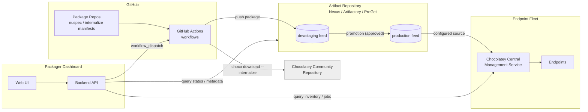
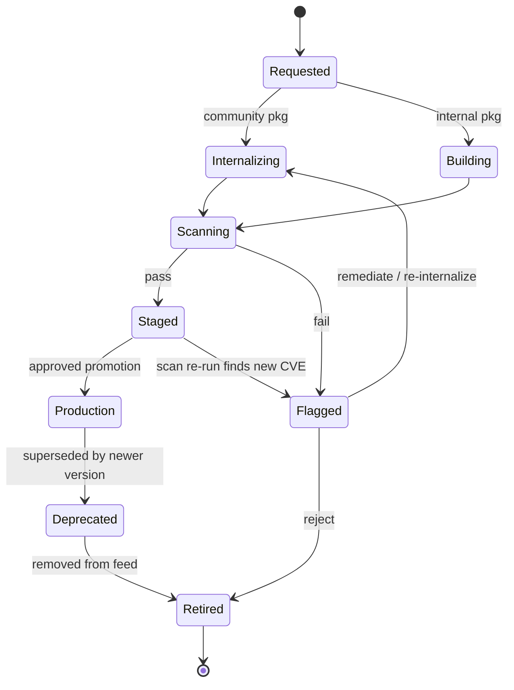

# Enterprise Chocolatey Package Lifecycle Management — Architecture Design

**Status:** Draft for review
**Scope:** On-premise lifecycle management for Chocolatey packages (Community-internalized and internally authored), governed by a packager dashboard and GitHub Actions, hosted on an existing artifact repository (Nexus / Artifactory / ProGet), with Chocolatey for Business (C4B) for endpoint deployment and reporting.

---

## 1. Purpose & Scope

This document describes an architecture for managing the full lifecycle of Chocolatey packages inside the enterprise: pulling in packages from the Chocolatey Community Repository and internalizing them (so installers never depend on the public internet), authoring and maintaining internal-only packages, and getting both kinds of packages safely into production feeds that endpoints pull from. The design assumes Chocolatey for Business is already licensed, and that there is an existing artifact repository (Nexus, Artifactory, or ProGet) that will serve as the system of record for built packages, rather than introducing a new repository product.

The two package types are treated as the same supply chain with different entry points: internalization is the "ingest from the internet" entry point, and the internal package build is the "author from scratch" entry point. Both converge on the same review, scan, promote, and deploy stages.

## 2. Goals

- Give packagers a single dashboard to request internalization of a Community package, author/update an internal package, see the state of any package in the pipeline, and view what's deployed where.
- Make GitHub the system of record for package definitions (nuspec, install scripts, internalization manifests) and GitHub Actions the execution engine for build, internalize, scan, and promote steps.
- Keep the existing artifact repository as the only thing endpoints ever talk to — no direct internet access to community.chocolatey.org from production endpoints.
- Provide an auditable, approval-gated path from "package requested" to "package available in production feed," with vulnerability scanning and sign-off before promotion.
- Use Chocolatey Central Management (CCM) for what it's good at — endpoint inventory, deployment plans, install/upgrade/uninstall orchestration, and compliance reporting — rather than trying to make it do package-supply-chain governance it wasn't built for.
- Support recurring re-internalization when upstream Community packages release new versions, without requiring a packager to notice manually.

## 3. Non-Goals

This design does not cover replacing the existing Nexus/Artifactory/ProGet instance, building a new artifact repository, or replacing CCM's endpoint management capabilities with custom tooling. It also does not cover non-Windows package ecosystems (npm, NuGet for .NET libraries, etc.) even if they happen to live in the same artifact repository — those are out of scope and assumed to already have their own governance.

## 4. Key Assumptions

Chocolatey for Business is licensed, which means Package Internalizer (recursive dependency internalization), Package Builder, and Central Management Service/Website are all available. The artifact repository already has (or can have) Chocolatey/NuGet-format hosted repositories provisioned, and supports at least two promotion tiers (e.g., staging and production) either as separate repos or via a promotion/tagging mechanism native to the product (ProGet has native package promotion; Artifactory and Nexus typically model this as separate repos plus a virtual/group repo). GitHub (cloud or Enterprise Server) is the version control and CI/CD platform, and self-hosted Windows runners are available or can be provisioned, since `choco` internalization commands require Windows.

## 5. System Overview



The packager dashboard is the human entry point. It never touches package binaries directly — it triggers and observes GitHub Actions runs, and reads metadata from the artifact repository and from CCM's reporting database. GitHub Actions is the only thing that writes to the feeds. CCM is the only thing that talks to endpoints. This separation keeps each system doing one job and keeps the audit trail in one place (GitHub Actions run history) rather than scattered across a custom orchestration layer.

## 6. Component Architecture

### 6.1 Source Control Layer

Two repository patterns are common in practice; pick one and stay consistent rather than mixing them.

**Single monorepo (recommended for small-to-medium catalogs, easier governance):** one repository, e.g. `choco-packages`, with a top-level split between `internal/<package-id>/` and `internalized/<package-id>/`. Each package folder contains its `.nuspec`, `tools/chocolateyinstall.ps1` (for internal packages) or an `internalize.json` manifest (for community packages — package id, pinned upstream version, internalization options), and a `metadata.yml` carrying maintainer, owner team, and lifecycle tags. CODEOWNERS at the folder level lets you require the right reviewer per package without splitting repos.

**One repo per package (recommended for large catalogs or strict per-package access control):** more repos to manage, but cleaner permissions and history per package, and avoids one repo growing into thousands of folders. This trades simplicity of governance for simplicity of access control — choose based on how often you need to restrict who can touch a specific package versus how often you need a single PR review queue across the whole catalog.

Either way, the manifest for a community package internalization request looks roughly like this:

```yaml
# internalized/7zip/internalize.yml
packageId: 7zip
pinnedVersion: "23.1.0"          # or "latest" to always re-check
source: https://community.chocolatey.org/api/v2/
internalizeOptions:
  recursive: true                 # pull dependencies too (C4B feature)
owner: platform-engineering
autoUpdateCheck: true             # opt into the scheduled update-check workflow
notes: "Approved for general use, no special restrictions"
```

### 6.2 Packager Portal (Dashboard)

CCM's website is endpoint-and-deployment focused; it has no native concept of "a packager requested internalization of curl and it's awaiting security review." That request/approval/visibility layer needs a thin custom application. It does not need to be elaborate — its job is to be a friendly front-end over three things you already have: GitHub (trigger workflows, show run status, show PRs), the artifact repository's REST API (list packages, versions, download counts, last-modified), and CCM's SQL Server reporting database (read-only queries for "where is this installed," "what's pending deployment").

Recommended shape: a small web app (e.g., a lightweight backend in Python/Node + a simple frontend) that authenticates packagers via your existing SSO/AD, and exposes:

1. A **catalog view** — every package currently in the feeds, its source (internalized vs. internal), current version, last update date, owning team, and vulnerability scan status (color-coded).
2. A **request form** — "Internalize a Community package," which searches the Chocolatey Community Repository (read-only API call) and on submit opens a PR creating the `internalize.yml` manifest, or directly fires a `workflow_dispatch` for already-onboarded packages needing a version bump.
3. A **pipeline status view** — embeds/links to the relevant GitHub Actions run so a packager can watch internalize → scan → test → stage progress without leaving the dashboard.
4. An **approval queue** — for packages sitting in staging awaiting promotion sign-off, surfaced to whoever holds the approver role (this can literally just be a filtered view of GitHub's "Environments" pending-deployment list, rendered nicely).
5. A **deployment view** — pulled from CCM's reporting data, showing install counts and versions in the field for a given package, so a packager deciding whether it's safe to deprecate an old version has the data in front of them.

This portal should be read-mostly with respect to the artifact repo and CCM — it queries them but the only system that writes packages is GitHub Actions, and the only system that issues install/uninstall commands to endpoints is CCM itself (the portal can deep-link into CCM's own UI for that rather than reimplementing it).

### 6.3 CI/CD Layer — GitHub Actions

This is the workhorse. All package-producing and package-promoting operations happen here, on self-hosted Windows runners (GitHub-hosted `windows-latest` runners work for the choco commands themselves, but self-hosted runners are usually necessary anyway for network-level access to an on-prem artifact repository, unless that repository is internet-reachable with proper auth). See Section 9 for the individual workflows and Section 13 for example YAML.

### 6.4 Artifact Repository Layer

The existing Nexus, Artifactory, or ProGet instance hosts at minimum two Chocolatey/NuGet-format repositories: a staging repo that GitHub Actions publishes every successful build/internalize to, and a production repo that only receives packages via an explicit, approved promotion step. A few product-specific notes worth knowing going in: ProGet has a native package promotion feature built for exactly this staging→production pattern and a built-in vulnerability-scanning integration, which may reduce custom tooling needed. Artifactory and Nexus Pro both support Chocolatey-format hosted repositories and you'd typically model promotion as either copying between two hosted repos or using a virtual/group repo with repository-level routing rules. Whichever product you're on, the production repo should be the *only* source endpoints are configured to pull from — never the staging repo, and never the public Community feed.

### 6.5 Endpoint Management Layer — Chocolatey Central Management

CCM (Central Management Service + Website + SQL Server backend) continues to do what it does today: maintain endpoint inventory, run deployment plans, push install/upgrade/uninstall jobs to groups of machines, and report on what's installed where. The one change from a typical CCM setup is that its agents/endpoints are configured to use the production feed in the artifact repository as their Chocolatey source instead of (or in addition to, during a transition period) the public Community repository. CCM's own Package Internalizer feature can be used interchangeably with `choco download --internalize` in Actions — the architecture in this doc runs internalization inside CI specifically so it's versioned, reviewed, and reproducible rather than a one-off action a packager ran locally.

### 6.6 Runner Infrastructure

A small pool of self-hosted Windows runners, ideally ephemeral (re-imaged or recreated per job) so that internalization jobs — which download and execute arbitrary third-party installers to inspect/repackage them — can't leave persistent state or credentials behind between runs. These runners need network access to community.chocolatey.org (outbound, for internalize jobs only) and to the artifact repository (for publish), and should not have standing credentials to the production feed — only to staging, with promotion requiring a separate, more tightly scoped credential used only in the approval-gated promotion workflow.

### 6.7 Security & Scanning Layer

Every internalized or freshly built package should pass through a scanning step before it's eligible for promotion: antivirus/AV scan of the embedded binaries, and a CVE/vulnerability check against known-vulnerable software versions (tools like Grype, OSV-Scanner, or a commercial SCA tool, or the artifact repository's built-in scanning if it has one — Artifactory Xray, Nexus IQ, and ProGet's vulnerability scanning all apply here). Results gate the promotion workflow rather than blocking the staging push, so packagers can still inspect a flagged package without it ever reaching production.

## 7. Package Lifecycle & State Machine



Each state transition corresponds to either a GitHub Actions workflow run completing, or a human approval action (recorded as a GitHub Environment deployment approval, which gives you a built-in audit trail of who approved what and when, without building a separate approvals database).

## 8. Repository & Feed Layout

| Layer | Naming convention | Example |
|---|---|---|
| GitHub repo (monorepo option) | `choco-packages` | `org/choco-packages` |
| Internal package folder | `internal/<package-id>/` | `internal/acme-launcher/` |
| Internalized package folder | `internalized/<package-id>/` | `internalized/7zip/` |
| Staging feed | `<product>-choco-staging` | `choco-staging` |
| Production feed | `<product>-choco-prod` | `choco-prod` |
| CCM source name on endpoints | matches production feed | `choco-prod` |

Keeping the production feed name identical across environments (don't call it `choco-prod-east` vs `choco-prod-west`) simplifies CCM deployment plans and avoids drift between sites if the artifact repository is itself distributed.

## 9. Detailed Workflows

### 9.1 Internalizing a New Community Package

1. Packager submits the request via the dashboard, specifying package ID and (optionally) a pinned version.
2. Dashboard backend opens a PR adding `internalized/<id>/internalize.yml` to the repo, or, if the manifest already exists and this is a fresh onboarding, fires `workflow_dispatch` directly.
3. On manifest merge (or direct dispatch), the `internalize-community-package.yml` workflow runs on a self-hosted Windows runner: `choco download <id> --internalize --source=https://community.chocolatey.org/api/v2/ --internalize-all-urls` (C4B's recursive internalizer handles dependencies automatically).
4. The resulting `.nupkg` is scanned (AV + CVE) per Section 6.7.
5. A smoke-test install runs in an isolated/ephemeral VM or container: `choco install <id> -s ./internalized --force -y` followed by basic verification (binary exists, version string matches expectation).
6. On success, the package is pushed to the staging feed and the dashboard's catalog view updates to reflect "Staged, awaiting promotion." On scan failure, the package is held (never pushed to staging) and the packager is notified with the scan report.

### 9.2 Re-internalizing on Upstream Update

A scheduled workflow (`scheduled-update-check.yml`, e.g. nightly or weekly) iterates every manifest with `autoUpdateCheck: true`, checks the Community Repository's current version against the pinned version, and for anything newer, either opens a PR bumping the pinned version (safer default — requires human merge to trigger re-internalization) or directly triggers the internalize workflow if the team has decided low-risk packages can auto-flow to staging without a PR. Either way it never auto-promotes to production — that gate stays manual regardless of how the internalization itself was triggered.

### 9.3 Publishing an Internal Package

For internally authored software, the workflow triggers on push/tag to `internal/<id>/**`: lint the nuspec, run `choco pack`, run the same scan and smoke-test steps as 9.1, and push to staging on success. Internal packages skip the "internalize from Community" step entirely but share every downstream step (scan, test, stage, promote) with internalized packages — this is the convergence point mentioned in Section 1.

### 9.4 Promotion Pipeline (Staging → Production)

Promotion is a separate workflow gated by a GitHub Environment with required reviewers (your approver role from the dashboard). It does not rebuild anything — it takes the exact `.nupkg` artifact already sitting in staging (by content hash, not by re-running the build) and copies/promotes it to production, so what gets approved is bit-for-bit identical to what was scanned and tested. This is the single most important integrity property of the pipeline: never rebuild between scan and production.

### 9.5 Vulnerability Scanning & Remediation

In addition to the pre-staging scan in 9.1/9.3, a periodic re-scan workflow runs against everything currently in the production feed (new CVEs get published against old software constantly, independent of any package change). Anything newly flagged moves to "Flagged" in the dashboard and triggers a notification to the owning team; remediation is either re-internalizing a patched upstream version or, if none exists, a decision to retire the package from production.

### 9.6 Deprecation & Retirement

Deprecation marks a package version as "don't deploy to new endpoints" without removing it from the feed (existing installs keep working). Retirement actually removes it from the production feed. Both are manual dashboard actions backed by a GitHub Actions workflow, and both should check CCM's deployment data first (Section 6.2, item 5) so a packager isn't retiring something with 4,000 active installs without at least seeing that number.

## 10. Dashboard Design

### 10.1 Views

The five views described in Section 6.2 (catalog, request form, pipeline status, approval queue, deployment view) form the core. A reasonable v1 can ship with just catalog + request form + pipeline status, adding the approval queue and deployment view once the basic internalize→stage flow is proven out — promotion approvals can temporarily happen directly in GitHub's UI without a dedicated dashboard view.

### 10.2 Roles & Permissions

Three roles cover most organizations: **Packager** (can request internalization, author internal packages, view everything) maps to write access on the GitHub repo plus dashboard login; **Approver** (can promote staging→production) maps to required-reviewer status on the GitHub Environment guarding the promotion workflow; **Viewer** (read-only catalog and deployment data, for stakeholders who want visibility without write access) maps to dashboard login only, no GitHub write access needed. Keep role assignment in GitHub teams/CODEOWNERS rather than a separate permissions table in the dashboard's own database — one less thing to keep in sync.

### 10.3 Integration Points

GitHub REST/GraphQL API (trigger workflow_dispatch, read run status, read PR/environment-approval state), the artifact repository's REST API (Nexus, Artifactory, and ProGet all expose package listing/metadata APIs), and a read-only connection to CCM's SQL Server reporting database for deployment/inventory queries. None of these require write access from the dashboard itself except the GitHub API calls that open PRs and dispatch workflows.

## 11. Data Model

The dashboard needs very little state of its own — most of "where is this package in its lifecycle" is derivable live from GitHub (open PRs, workflow run status, environment approval state) and the artifact repo (which feed contains which version). The one thing worth persisting locally is package-level metadata that doesn't live naturally anywhere else:

| Field | Source | Notes |
|---|---|---|
| `package_id` | manifest | primary key |
| `type` | manifest | `internal` \| `internalized` |
| `owner_team` | manifest | drives notification routing |
| `pinned_version` / `current_version` | manifest / feed | |
| `auto_update_check` | manifest | bool |
| `last_scan_result` | scan workflow output | cached for dashboard speed; source of truth is the workflow run artifact |
| `lifecycle_state` | derived | computed from GitHub + feed state, not stored independently to avoid drift |

Avoid storing `lifecycle_state` as an independently-writable field — if it can drift from what GitHub/the feed actually say, the dashboard becomes a second source of truth that can lie. Compute it on read.

## 12. Security & Governance

A few principles worth calling out explicitly rather than leaving implicit: production endpoints should have no network path to community.chocolatey.org at all, only to the internal production feed — internalization exists precisely to make that possible. Promotion credentials (write access to the production feed) should be scoped separately from staging-publish credentials and used only inside the promotion workflow, never inside the internalize/build workflows. GitHub Environment protection rules (required reviewers, possibly a wait timer) are the approval mechanism — resist building a custom approvals database, since you'd just be reimplementing what Environments already audit for you. Self-hosted internalization runners should be ephemeral given they execute arbitrary third-party installers during the internalize step. Finally, package signing (Authenticode-signing the resulting packages, or at minimum Chocolatey package signing) is worth doing if your endpoints can enforce signature verification — it closes the gap between "passed scanning at promotion time" and "this is still the exact bits installed on an endpoint six months later."

## 13. GitHub Actions Workflow Examples

These are illustrative skeletons, not production-ready files — they're meant to show the shape of each workflow rather than be copy-pasted verbatim.

**Internalize a Community package** (`internalize-community-package.yml`):

```yaml
name: Internalize Community Package
on:
  workflow_dispatch:
    inputs:
      package_id:
        required: true
      version:
        required: false
        default: "latest"

jobs:
  internalize:
    runs-on: [self-hosted, windows, choco-internalize]
    steps:
      - uses: actions/checkout@v4

      - name: Internalize package
        run: |
          choco download ${{ github.event.inputs.package_id }} `
            --internalize --source="https://community.chocolatey.org/api/v2/" `
            --internalize-all-urls --version=${{ github.event.inputs.version }}

      - name: Scan binaries
        run: ./scripts/scan-package.ps1 -PackagePath .\packages\

      - name: Smoke test install
        run: |
          choco install ${{ github.event.inputs.package_id }} -s .\packages\ --force -y

      - name: Push to staging feed
        run: |
          choco push .\packages\*.nupkg --source=$env:STAGING_FEED_URL --api-key=$env:STAGING_API_KEY
```

**Promote staging → production** (`promote-package.yml`), gated by a GitHub Environment:

```yaml
name: Promote to Production
on:
  workflow_dispatch:
    inputs:
      package_id: { required: true }
      version: { required: true }

jobs:
  promote:
    runs-on: [self-hosted, windows]
    environment: production-feed   # required reviewers configured here
    steps:
      - name: Copy package by content hash from staging to production
        run: ./scripts/promote-package.ps1 `
            -PackageId ${{ github.event.inputs.package_id }} `
            -Version ${{ github.event.inputs.version }} `
            -SourceFeed $env:STAGING_FEED_URL `
            -TargetFeed $env:PRODUCTION_FEED_URL
```

**Scheduled update check** (`scheduled-update-check.yml`):

```yaml
name: Check for Upstream Updates
on:
  schedule:
    - cron: "0 6 * * 1"   # weekly, Monday 06:00

jobs:
  check-updates:
    runs-on: [self-hosted, windows]
    steps:
      - uses: actions/checkout@v4
      - name: Compare pinned vs. upstream versions
        run: ./scripts/check-upstream-versions.ps1 -ManifestDir .\internalized\
      - name: Open PRs for outdated packages
        run: ./scripts/open-version-bump-prs.ps1
```

## 14. Implementation Roadmap

A reasonable phasing avoids trying to ship the dashboard and the full pipeline simultaneously.

**Phase 1 — Pipeline foundation:** stand up the staging and production feeds in the existing artifact repository, get the internalize and build workflows running against a handful of pilot packages, manually triggered via `workflow_dispatch` from the GitHub UI (no dashboard yet). Validate the scan-and-promote gate works end to end.

**Phase 2 — CCM cutover:** point a pilot group of endpoints at the production feed via CCM deployment plans, alongside their existing source, then fully cut over once confidence is established.

**Phase 3 — Dashboard v1:** ship catalog + request form + pipeline status views, backed by GitHub and artifact-repo APIs. Promotion approvals still happen in native GitHub UI.

**Phase 4 — Dashboard v2 + automation:** add the approval queue and deployment views, turn on the scheduled update-check workflow, and add the periodic re-scan of production for newly disclosed CVEs.

## 15. Open Decisions Needed From Your Team

A few things this document deliberately leaves open because they depend on details only you have: which artifact repository product specifically (Nexus, Artifactory, or ProGet — the promotion mechanics differ meaningfully, especially ProGet's native promotion vs. the others' separate-repo approach), monorepo vs. one-repo-per-package for the GitHub layer, whether re-internalization on upstream updates should require a PR merge or be allowed to auto-flow to staging for low-risk packages, and what your existing SSO/identity provider is, since that determines how the dashboard authenticates packagers and how roles map to GitHub teams.

## 16. Appendix: Key Chocolatey Commands Referenced

| Command | Purpose |
|---|---|
| `choco download <id> --internalize --source=<url>` | Downloads installer + repackages nuspec to reference internal storage |
| `choco pack` | Builds a `.nupkg` from a local `.nuspec` (internal packages) |
| `choco push <nupkg> --source=<url> --api-key=<key>` | Publishes a package to a feed |
| `choco install <id> -s <source> --force -y` | Used for smoke-testing a freshly built/internalized package |
