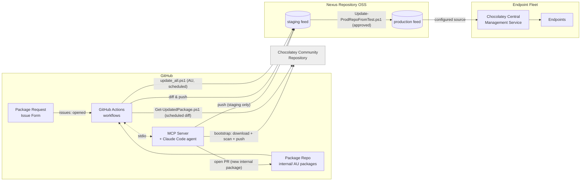
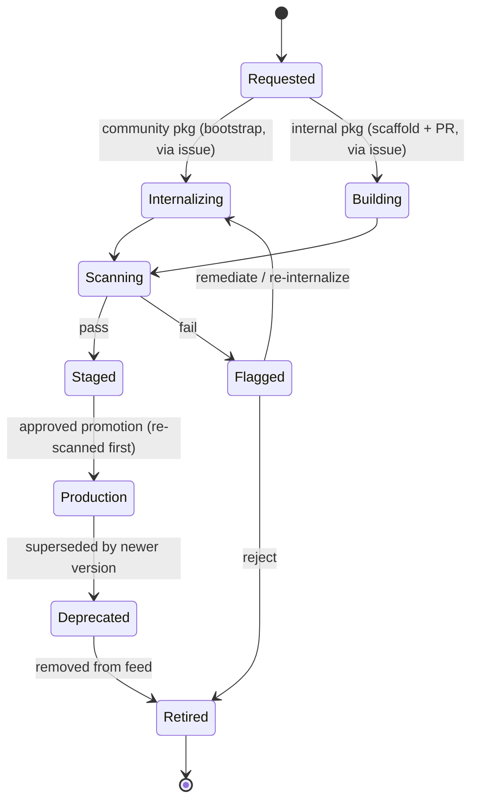

# Enterprise Chocolatey Package Lifecycle Management — Architecture Design

**Status:** Core pipeline implemented and tested (Parts 1–3 below); a full visibility dashboard and ephemeral-runner automation remain open.
**Scope:** On-premise lifecycle management for Chocolatey packages (Community-internalized and internally authored), driven by GitHub Actions, an issue-triggered creation flow backed by an MCP server, and Chocolatey's AU (Automatic Packages) module — hosted on Nexus Repository OSS, with Chocolatey for Business (C4B) for endpoint deployment and reporting.

---

## 1. Purpose & Scope

This document describes an architecture for managing the full lifecycle of Chocolatey packages inside the enterprise: pulling in packages from the Chocolatey Community Repository and internalizing them (so installers never depend on the public internet), authoring and maintaining internal-only packages, and getting both kinds of packages safely into production feeds that endpoints pull from. The design assumes Chocolatey for Business is already licensed, and uses Nexus Repository OSS as the system of record for built packages.

The two package types are treated as the same supply chain with different entry points: internalization is the "ingest from the internet" entry point, and the internal package build is the "author from scratch" entry point. Both converge on the same scan and promote stages. Unlike the original design of this document, staleness is no longer tracked through a reviewed manifest file — it's determined by directly diffing feed contents against the upstream source (Community Repository, or each internal package's own vendor release page), and a new package is requested through a GitHub Issue that an AI agent turns into a bootstrap push or a PR.

## 2. Goals

- Let a packager request a new package — internalized from the Community Repository, or an internal package tracking its own vendor's releases — by opening a GitHub Issue from a form, without hand-authoring nuspec/manifest files themselves. A full catalog/deployment-visibility dashboard (Section 10) remains a future enhancement, not required for the request/creation flow itself.
- Make GitHub the system of record for package definitions (nuspec, install scripts, AU update scripts) and GitHub Actions the execution engine for internalize, build, scan, refresh, and promote steps.
- Keep Nexus as the only thing endpoints ever talk to — no direct internet access to community.chocolatey.org from production endpoints.
- Provide vulnerability scanning before anything reaches staging, and a human-approved promotion gate before anything reaches production.
- Use Chocolatey Central Management (CCM) for what it's good at — endpoint inventory, deployment plans, install/upgrade/uninstall orchestration, and compliance reporting — rather than trying to make it do package-supply-chain governance it wasn't built for.
- Keep already-onboarded packages current automatically: internalized packages are re-checked against the Community Repository on a schedule, and internal (AU) packages check their own vendor's release page on a schedule — neither needs a packager to notice a new upstream version manually.

## 3. Non-Goals

This design does not cover replacing Nexus, or replacing CCM's endpoint management capabilities with custom tooling. It also does not cover non-Windows package ecosystems (npm, NuGet for .NET libraries, etc.) even if they happen to live in the same artifact repository — those are out of scope and assumed to already have their own governance.

## 4. Key Assumptions

Chocolatey for Business is licensed (Package Internalizer, Package Builder, Central Management Service/Website). **Nexus Repository OSS** is the artifact repository — no Nexus IQ license is assumed, so vulnerability scanning is done with Grype rather than Nexus's own scanning integration. GitHub (cloud or Enterprise Server) is the version control and CI/CD platform. Self-hosted Windows runners are required, since `choco` internalization and AU both require Windows; they additionally need Node.js and the Claude Code CLI (`claude`) installed for the issue-triggered creation flow (Section 6.8), and an `ANTHROPIC_API_KEY` secret configured for that workflow.

## 5. System Overview



GitHub Actions is the only thing that writes to the feeds. CCM is the only thing that talks to endpoints. The MCP server never writes anywhere on its own — every write it makes (a push to staging, a PR) is one of five narrowly-scoped tools, each a thin wrapper around a script that already existed independently of the agent. This separation keeps each system doing one job and keeps the audit trail in GitHub Actions run history and PR history.

## 6. Component Architecture

### 6.1 Source Control Layer

A single monorepo, `chocolatey-packages`, with a top-level split between `internal/<package-id>/` and `internalized/`.

**`internal/<package-id>/`** — each internal package is an [AU](https://github.com/majkinetor/AU) (Chocolatey Automatic Packages) package: it checks its own release source directly and updates itself, rather than being hand-maintained.

```
internal/<package-id>/
├── <package-id>.nuspec       # filename MUST match the folder name — AU
│                              # discovers packages by nuspec filename, not
│                              # just the <id> element (confirmed by testing)
├── metadata.yml               # owner/lifecycle fields AU doesn't track
├── update.ps1                 # au_GetLatest / au_SearchReplace hooks
└── tools/
    └── chocolateyinstall.ps1   # url/checksum left empty — filled in by
                                 # au_SearchReplace at update time
```

**`internalized/`** — no manifest file. Presence in the **staging feed** is the record of what's currently onboarded; a scheduled job (Section 9.2) diffs staging against the Community Repository directly rather than reading a tracked file. This replaced an earlier design that used a per-package `internalize.yml` manifest requiring a PR to bump a pinned version — the manifest added a layer of tracked state that could drift from what was actually in the feed, so it was dropped in favor of asking the feed itself.

CODEOWNERS at the folder level lets you require the right reviewer per internal package without splitting repos.

### 6.2 Request & Creation Layer

The entry point for "onboard a package I haven't touched before" is a **GitHub Issue Form** (`.github/ISSUE_TEMPLATE/package-request.yml`): package type (internalized vs. internal), package id, source URL (for internal packages), owner team, notes. Opening it triggers `handle-package-request.yml` (Section 6.8), which runs an AI agent against a **narrowly-scoped MCP server** to do the actual work:

- **Internalized package requested** → the agent calls `bootstrap_internalize_package`, which downloads, internalizes, scans, and pushes straight to the **staging feed only**. There's nothing to review in a PR here, since internalized packages have no tracked manifest — the scan result and the push itself are the audit trail. `refresh-internalized-packages.yml` (Section 9.2) takes over keeping it current from that point on, without the agent being involved again.
- **Internal package requested** → the agent scaffolds a new `internal/<id>/` folder from a template, lints it, and opens a PR. A human still reviews and merges — `update.ps1`'s `au_GetLatest` almost always needs a person to verify the scraping logic actually matches the vendor's real release page before it's trusted to run unattended.

A full catalog/approval-queue/deployment-visibility dashboard (as originally sketched — Section 10) remains a reasonable future addition once this request flow is proven out, but isn't required for it to work: GitHub's own Issues, PRs, and Environment approval UI already provide the request/review/approve surface.

### 6.3 CI/CD Layer — GitHub Actions

This is the workhorse. All package-producing and package-promoting operations happen here, on self-hosted Windows runners. See Section 9 for the individual workflows.

### 6.4 Artifact Repository Layer — Nexus Repository OSS

Nexus hosts two NuGet-format hosted repositories: a staging repo that every successful internalize/refresh/AU-update pushes to, and a production repo that only receives packages via the approval-gated promotion workflow. Nexus OSS has no native package-promotion feature (that's a ProGet-specific capability this design originally left open) and no built-in vulnerability scanning (that's a Nexus IQ feature, not licensed here) — promotion here is a scripted diff-and-copy (`Update-ProdRepoFromTest.ps1`, Section 9.4) with scanning done by Grype instead (Section 6.7). The production repo is the *only* source endpoints are configured to pull from — never staging, never the public Community feed.

### 6.5 Endpoint Management Layer — Chocolatey Central Management

CCM (Central Management Service + Website + SQL Server backend) continues to do what it does today: maintain endpoint inventory, run deployment plans, push install/upgrade/uninstall jobs to groups of machines, and report on what's installed where. Its agents/endpoints are configured to use the Nexus production feed as their Chocolatey source instead of the public Community repository.

### 6.6 Runner Infrastructure

A pool of self-hosted Windows runners. Today this is a single runner (labels `self-hosted, windows, choco-internalize`) serving every workflow; the original design called for splitting it into a `choco-internalize` pool (network access to community.chocolatey.org) and a general pool (no such access, tighter network segmentation) once volume justifies the extra machine to manage — that split is still an open item (Section 15), not yet built.

Prerequisites installed on the runner: `choco` (C4B-licensed), `git`, `gh`, `grype`, the `AU` PowerShell module, and — new for the issue-triggered creation flow — **Node.js** and the **Claude Code CLI** (`claude`), both on `PATH`. Ideally the runner is ephemeral (re-imaged or recreated per job) given internalize jobs download and execute arbitrary third-party installers; that automation isn't built yet either (Section 15).

### 6.7 Security & Scanning Layer

Every internalized, refreshed, or freshly built package passes through `scripts/scan-package.ps1` before it's eligible for promotion: an AV scan via Windows Defender (`MpCmdRun.exe`) and a CVE/vulnerability scan via [Grype](https://github.com/anchore/grype) against the package's extracted contents, failing on any match at or above a configurable severity (default `High`). This runs at internalize/bootstrap time, at AU update time, and again just before each package is promoted from staging to production (Section 9.4) — but **not** on a recurring basis against packages that are already sitting in production. The original design called for a periodic re-scan of the whole production feed to catch newly disclosed CVEs against software that hasn't itself changed; that periodic re-scan was never built. This is a known gap — see Section 9.5 and Section 15.

### 6.8 MCP Server & Agent-Driven Package Creation

`mcp-server/` is a small Node.js server ([`@modelcontextprotocol/sdk`](https://github.com/modelcontextprotocol/typescript-sdk)) exposing eight tools. Each is a thin wrapper around an existing script, a public API, or a small, auditable git/file operation — no package-management logic is reimplemented in the server itself:

| Tool | Wraps | Write scope |
|---|---|---|
| `search_community_package` | `choco search --exact --limit-output` | none (read-only) |
| `lint_package` | `scripts/lint-nuspec.ps1` | none (read-only) |
| `search_evergreen_app` | [evergreen-api.stealthpuppy.com](https://eucpilots.com/evergreen/api/) `/apps` index | none (read-only) |
| `get_evergreen_app_info` | evergreen-api `/app/{name}` | none (read-only) |
| `search_silent_install_switch` | best-effort scrape of one [manageengine.com](https://www.manageengine.com/products/desktop-central/software-installation) catalog snapshot page — not exhaustive; a miss doesn't mean no switch exists | none (read-only) |
| `scaffold_internal_package` | copies `internal/_template/`, fills in placeholders; given `evergreen_app_name`/`silent_args`, generates a real `au_GetLatest`/silent switch instead of a generic guess | local working tree only |
| `bootstrap_internalize_package` | download → `scan-package.ps1` → push | **staging feed only** — refuses to run if `STAGING_FEED_URL`/`STAGING_API_KEY` aren't set, and never receives production credentials |
| `open_pull_request` | `git`/`gh` | opens a PR against `main`; never merges |

The two evergreen-api tools and `scaffold_internal_package`'s use of them were added after real testing on `temurin17` showed how much better a scaffolded AU package is when it starts from a real, working `au_GetLatest` instead of a CHANGE_ME placeholder. `search_silent_install_switch` was added for the same reason for `silentArgs`, with an explicit caveat baked into the tool's own description: ManageEngine has no search API, so this only scans one non-paginated catalog page — good enough to often help, not something to treat as authoritative when it comes up empty.

`.github/workflows/handle-package-request.yml` runs the agent (Claude Code, headless: `claude -p ... --mcp-config mcp-server/mcp-config.json --strict-mcp-config --allowedTools <exactly these 8 tools> --permission-mode bypassPermissions --output-format json`) against the issue body, and posts the agent's one-line result back as an issue comment. Two things worth calling out about how untrusted content is handled here: the issue body (and later, the agent's own response) are passed into the workflow via `env:` variables and referenced from the PowerShell script, never spliced directly into the `run:` block's script text — doing the latter is a real script-injection vector in GitHub Actions, since `${{ }}` expressions are substituted as literal text into the script *before* the shell parses it. `--strict-mcp-config` plus the explicit `--allowedTools` list also means the agent has no access to any tool beyond these five, regardless of what else might be configured on the runner.

## 7. Package Lifecycle & State Machine



Compared to the original design, `Staged --> Flagged : scan re-run finds new CVE` no longer applies to packages that have *stayed* in staging without a new push — there's no periodic re-scan of stationary staged or production packages (Section 6.7 gap). The transition still happens for anything that moves (a refresh, an AU update, a promotion), each of which re-scans as part of the move. Each transition corresponds to either a GitHub Actions workflow run completing or a human approval action (a GitHub Environment deployment approval — a PR merge for internal packages).

## 8. Repository & Feed Layout

| Path | Purpose |
|---|---|
| `internal/<package-id>/` | AU-based internal packages (Section 6.1) |
| `internal/_template/` | Copy this to onboard a new internal package by hand; `scaffold_internal_package` does the same programmatically |
| `internalized/` | No manifest — README only; presence in the staging feed is the record |
| `scripts/` | Operational scripts with required parameters: `lint-nuspec.ps1`, `scan-package.ps1`, `Get-UpdatedPackage.ps1`, `Update-ProdRepoFromTest.ps1`, `ConvertTo-ChocoObject.ps1` |
| `scripts/au-helpers/` | Pure AU-authoring helper functions (e.g. `Set-DescriptionFromReadme.ps1`), swept in bulk by `all.ps1` — kept separate from `scripts/` because that sweep would break against scripts with required parameters |
| `scripts/lib/` | `SimpleYaml.ps1` — a minimal, dependency-free reader for `metadata.yml`'s flat structure |
| `mcp-server/` | The MCP server (Section 6.8) |
| `update_all.ps1` / `test_all.ps1` / `update_vars_default.ps1` | AU's repo-root drivers (from [au-packages-template](https://github.com/majkinetor/au-packages-template)) — see `internal/README.md` |
| `docs/architecture.md` | This document |

Feed names: `choco-staging` and `choco-prod` (Nexus hosted repos), matched by the CCM source name on endpoints. Keeping the production feed name identical across environments simplifies CCM deployment plans and avoids drift if Nexus is itself distributed across sites.

## 9. Detailed Workflows

### 9.1 Bootstrapping a New Internalized Package

One-time, for a package not yet in the staging feed. Two equivalent paths:

- **Via an Issue**: the `bootstrap_internalize_package` MCP tool (Section 6.8) does it as part of handling a package-request issue.
- **Manually**: `.github/workflows/internalize-community-package.yml`, `workflow_dispatch`, on the `choco-internalize` runner pool. Resolves the requested version via `choco search --exact --limit-output` (never passes the literal string `"latest"` to `choco`'s `--version` flag — it doesn't understand that value), then `choco download --internalize --outputdirectory=.\packages\`, `scan-package.ps1`, a smoke-test `choco install` from the local folder, then `choco push` to staging.

Either way, this is a one-time step — `refresh-internalized-packages.yml` (below) takes over from here.

### 9.2 Keeping Internalized Packages Up to Date

`.github/workflows/refresh-internalized-packages.yml` runs daily (and on demand), calling `scripts/Get-UpdatedPackage.ps1 -LocalRepo <staging> -RemoteRepo <Community Repository>`. It lists every package currently in staging (`choco search --limit-output`), looks up the exact match for each in the Community Repository, and for anything with a newer remote version: downloads + internalizes + scans + pushes the update straight to staging. No PR, no manifest — package staleness is answered by diffing the feed, not by reading tracked state.

### 9.3 Internal (AU) Packages

- **On a PR** touching `internal/**`: `.github/workflows/test-internal-packages.yml` lints the changed package(s) and force-tests them via AU's `test_all.ps1` (`Force=true`, `Push=false`) — never touches a feed.
- **On a schedule**: `.github/workflows/update-internal-packages.yml` lints every package, points `choco`'s default push source/API key at staging (`choco config set --name defaultPushSource`, `choco apikey add`), and runs `update_all.ps1` (AU's `updateall`), which checks each package's `au_GetLatest` and pushes anything newer straight to staging.

New internal packages are created via the Issue → `scaffold_internal_package` → PR flow (Section 6.2), or by hand from `internal/_template/`.

### 9.4 Promotion Pipeline (Staging → Production)

`.github/workflows/promote-package.yml`, gated by the `production-feed` GitHub Environment with required reviewers, runs `scripts/Update-ProdRepoFromTest.ps1 -TestRepo <staging> -ProdRepo <production>`. It diffs every package/version in staging against what's already in production, and for anything missing: downloads it, **re-scans it** (`scan-package.ps1` — this is a second, independent scan, not a reuse of the staging-time result), and pushes it on to production. This differs from the original design's "promote by content hash, never rebuild" property — that property is preserved in spirit (nothing is repacked between staging and production, `choco download` + `choco push` move the same bytes) but the re-scan means a package could theoretically fail here even after passing at staging time, if a new CVE was disclosed in between. That's intentional, not a bug: it's the closest this implementation gets to the periodic-rescan capability described in the original design (Section 6.7) — but only for packages actively being promoted, not ones already resident in either feed.

### 9.5 Vulnerability Scanning & Remediation

Scanning happens at four points: bootstrap, scheduled refresh, AU update, and promotion (Section 9.4's re-scan). **There is no periodic re-scan of packages already sitting in staging or production without a new push** — this was called out as a goal in the original design (catching a newly disclosed CVE against software that hasn't itself changed) and was not built. Anything flagged at any of the four scan points is simply not pushed/promoted; there's no "Flagged" state persisted anywhere for something already resident in a feed, since there's no tracked package state to flag it in (Section 8). Closing this gap — a scheduled job that re-scans everything currently in production regardless of whether it changed — is an open item (Section 15).

### 9.6 Deprecation & Retirement

Deprecation (stop deploying to new endpoints, leave existing installs alone) and retirement (remove from the production feed) are still manual, direct actions against Nexus's own package administration UI plus a CCM deployment-plan change, rather than a dashboard-backed workflow — the dashboard that would surface "4,000 active installs" before a retirement decision (Section 10) hasn't been built. Check CCM's reporting data directly before retiring anything with meaningful install counts.

## 10. Dashboard Design (Deferred)

The original five-view dashboard concept (catalog, request form, pipeline status, approval queue, deployment view) is not built. The request-form and pipeline-status roles are now covered by the Issue Form + Actions run history (Section 6.2); the approval queue is GitHub's own Environment reviewer UI. What's genuinely still missing without a dashboard: a single catalog view across both feeds, and the deployment view pulling CCM's install-count data before a deprecation/retirement decision (Section 9.6). Building those two views, backed by the Nexus and CCM REST/SQL APIs exactly as originally scoped, remains reasonable future work — nothing about the implemented pipeline needs to change to add them later, since they'd be purely read-only.

## 11. Data Model

There is now less tracked state than the original design called for, not more:

| Field | Source | Notes |
|---|---|---|
| `owner`, `notes` | `internal/<id>/metadata.yml` | The only persisted per-package metadata that exists anywhere — internal packages only |
| everything else (version, staged/production status, scan result) | derived from feed contents at query time | `choco search`/`choco search --all-versions` against staging/production, per Section 9 |

Internalized packages carry **zero** repo-tracked metadata — no owner, no notes, nothing — since the manifest that would have carried it was retired (Section 6.1). If per-package ownership/notes tracking for internalized packages turns out to matter in practice, that's a real gap to revisit, not something this design currently has an answer for.

## 12. Security & Governance

Production endpoints have no network path to community.chocolatey.org at all, only to the Nexus production feed. Promotion credentials (`PRODUCTION_API_KEY`) are scoped separately from staging-publish credentials (`STAGING_API_KEY`) and are only ever passed to the `promote-package.yml` workflow's environment — never to the internalize, refresh, AU-update, or issue-handling workflows. `bootstrap_internalize_package` and `open_pull_request` (Section 6.8) both refuse cleanly if their required credentials aren't present in the MCP server's environment, rather than failing partway through. The agent invoked by `handle-package-request.yml` has its tool access restricted to exactly the five MCP tools (`--strict-mcp-config` plus an explicit `--allowedTools` list) and runs non-interactively (`--permission-mode bypassPermissions`) — safe specifically *because* the tool list is that tightly scoped, not despite it. Untrusted content (the issue body, the agent's own response) is passed through `env:` variables into workflow scripts rather than interpolated directly into `run:` blocks, avoiding a real script-injection vector.

GitHub Environment protection rules (required reviewers on `production-feed`) remain the approval mechanism — no separate approvals database. Self-hosted runners executing internalize/bootstrap jobs should be ephemeral, given they run arbitrary third-party installers; that automation is still open (Section 15). Package signing is worth doing if endpoints can enforce signature verification, unchanged from the original design.

## 13. GitHub Actions Workflows

These are real, implemented files now — not illustrative skeletons — so this section just points to them rather than duplicating (and risking drift from) their actual content:

| Workflow | Trigger | Purpose |
|---|---|---|
| `.github/workflows/internalize-community-package.yml` | `workflow_dispatch` | One-time bootstrap of a new Community package into staging (Section 9.1) |
| `.github/workflows/refresh-internalized-packages.yml` | daily schedule, `workflow_dispatch` | Diff staging vs. Community Repository, re-internalize what's newer (Section 9.2) |
| `.github/workflows/test-internal-packages.yml` | PR touching `internal/**` | Lint + force-test changed AU packages, no push (Section 9.3) |
| `.github/workflows/update-internal-packages.yml` | daily schedule, `workflow_dispatch` | Lint + `update_all.ps1` (AU) against every internal package, pushes to staging (Section 9.3) |
| `.github/workflows/promote-package.yml` | daily schedule, `workflow_dispatch`, `production-feed` environment | Diff staging vs. production, re-scan, promote (Section 9.4) |
| `.github/workflows/handle-package-request.yml` | Issue opened with `package-request` label | Runs the MCP-backed agent to bootstrap or scaffold+PR a requested package (Section 6.8) |

## 14. Implementation Status & Roadmap

**Done:** the pipeline foundation described in Sections 6–9 is implemented and has been validated end-to-end against a real NuGet-compatible feed — not literal Nexus, but nothing in this pipeline calls a Nexus-specific API any more (that was true of an earlier, since-retired version of the promotion script; today everything is plain `choco search`/`download`/`push`), so a stand-in feed exercises the exact same code paths. The stand-in used was [BaGetter](https://github.com/bagetter/bagetter) (a maintained, lightweight NuGet-server fork) run via Docker — see the box below. Confirmed working against it: `Get-UpdatedPackage.ps1`'s full diff → internalize → scan → push cycle (including its recursive dependency internalization), `Update-ProdRepoFromTest.ps1`'s full diff → re-scan → promote cycle, and the `bootstrap_internalize_package` MCP tool end-to-end. Two real bugs were found and fixed by this testing, not just by reading the code:

- `Get-UpdatedPackage.ps1` never called `scan-package.ps1` at all — every scheduled refresh would have pushed straight to staging with no AV/CVE check, contradicting what this document already claimed in Sections 6.7/9.2.
- `Update-ProdRepoFromTest.ps1` didn't pass `--version` to `choco download`, so it always fetched whatever was *latest* in staging regardless of which version a given diff entry was actually for — harmless when staging holds one version per package, but it silently re-downloaded/re-scanned the same latest version repeatedly and threw a confusing 409 Conflict on the second push whenever staging held more than one version of something (which it will in practice, since nothing prunes old versions from staging).

**Also done — validated on the real self-hosted runner via actual GitHub Actions runs**, not just locally: `internalize-community-package.yml`, `refresh-internalized-packages.yml`, and `promote-package.yml` have each completed successfully end-to-end against the BaGetter stand-in feeds, triggered exactly as they'd be triggered for real (`workflow_dispatch` via `gh`, watched via `gh run watch`). This surfaced a third real bug and one piece of runner environment drift, neither visible from local testing alone:

- `internalize-community-package.yml`'s push step ran `choco push .\packages\*.nupkg ...` — `choco.exe` does not glob-expand its own file argument, and PowerShell doesn't do bash-style wildcard expansion for external-command arguments either, so the literal string (wildcard and all) was passed through and the push failed with "File specified is either not found or not a .nupkg file", even with real files sitting right there. Fixed by enumerating with `Get-ChildItem` and pushing each match's full path, matching what `Get-UpdatedPackage.ps1`/`Update-ProdRepoFromTest.ps1` already did correctly.
- The runner had an unrelated, pre-existing broken dependency (a `python3` package installed with `--ignore-dependencies` that never actually pulled in the `python314` it depends on) that made the smoke-test step's `choco install --force` fail — `--force` triggers a whole-lib dependency-consistency check, not just a check of the package being installed, so an unrelated broken package elsewhere in the same lib blocks it. Not a pipeline bug, but a concrete illustration of why Section 6.6 calls for ephemeral runners: a shared, long-lived runner accumulates state that can interfere with jobs that have nothing to do with it.

**Also done — the full issue → agent → PR path, end-to-end, for real**: a genuine package request (`temurin17` as an Internal/AU package, tracking Eclipse Adoptium's release page directly rather than the Community Repository's own `temurin17` package, which can lag behind it) went from a GitHub Issue through `handle-package-request.yml`, the headless agent, `scaffold_internal_package`, `lint_package`, and `open_pull_request` to a real, correctly-formed PR. This was the one piece of the pipeline that had only been validated tool-by-tool before; now the full agent loop calling them in sequence from a real issue is confirmed working. Getting there surfaced several more real, testing-only-findable issues:

- `handle-package-request.yml` originally triggered only on `opened`; an issue created via `gh issue create --label` applies the label as a separate call after creation, so the `opened` payload's label list was still empty and the job skipped. Real Issue Form submissions through the GitHub UI don't hit this (the form applies its labels as part of the same submission), but anything that labels an issue after the fact does — added `labeled` as a second trigger type.
- That fix then let a single label-cycling event fire two concurrent runs for the same issue (observed directly: two run IDs for one trigger). Added a `concurrency: group: package-request-${{ github.event.issue.number }}` with `cancel-in-progress: true` so a second event supersedes the first instead of running the agent, and potentially opening a PR or pushing to staging, twice for one request.
- `open_pull_request`'s git commit failed with "Author identity unknown" on a runner that had never had `git user.name`/`user.email` set — and the agent correctly refused to guess an identity itself and reported the failure instead, exactly the boundary it was supposed to respect. Fixed by having the tool configure a bot identity (`git config --local`, never touching the runner's global config, only filling in what's missing) before committing.
- `ANTHROPIC_API_KEY` failed outright with "Credit balance is too low" on first real use — not a pipeline bug, but confirmed the failure path works correctly (the error was captured and posted back to the issue as intended). Switched to `CLAUDE_CODE_OAUTH_TOKEN` (from `claude setup-token`) instead, which authenticates against a Claude Pro/Max subscription's included usage rather than pay-per-token billing — confirmed via Claude Code's own docs rather than assumed, since this session had already gotten several `claude`/`choco` flag details wrong by guessing.
- A retry after an earlier partial failure (branch pushed, but `gh pr create` rejected because the repo's "Allow GitHub Actions to create and approve pull requests" setting was off) then failed differently: `git checkout -b` refused because that branch already existed with no PR for it. Added `reconcileExistingBranch()`: if a PR already exists for the branch, return its URL as-is (idempotent); if the branch exists with no PR, it's machine-owned by naming convention (`package-request/<id>`), so delete it locally and on origin and proceed clean rather than fail the whole retry on stale state.

What's still only validated against BaGetter, not literal Nexus: the promotion workflow's `environment: production-feed` reviewer gate — the Environment auto-created on first use with no required reviewers configured, so promotion runs so far weren't actually approval-gated yet (GitHub Environment behavior itself doesn't depend on the feed product, so validating the gate itself is low-risk, just not yet done) — and anything Nexus-specific an eventual real deployment might still need (auth scheme, TLS, network placement), none of which this design currently depends on. Still open: `update-internal-packages.yml`/`test-internal-packages.yml` against a real (non-template) internal package — the `temurin17` PR above adds one, but it hasn't merged/run through those workflows yet, and its `update.ps1`'s `au_GetLatest` still needs a human to verify the scraping logic against Adoptium's actual release page before it's trusted to run unattended.

> **Testing this pipeline without Nexus:** run a throwaway NuGet-compatible feed in Docker and point `STAGING_FEED_URL`/`PRODUCTION_FEED_URL` at it — no Nexus-specific code exists to work around.
> ```
> docker run -d --name choco-test-staging -p 5555:8080 -e ApiKey=test-key bagetter/bagetter:latest
> docker run -d --name choco-test-prod    -p 5556:8080 -e ApiKey=test-key-prod bagetter/bagetter:latest
> ```
> Source URL for both `choco` and this repo's scripts: `http://localhost:5555/v3/index.json` (BaGetter is a v3-only feed; push still goes through the standard `/api/v2/package` endpoint that choco already expects). `docker rm -f choco-test-staging choco-test-prod` tears it down — nothing persists outside the containers.

**Still open, roughly in order of what would unblock real use:**

1. Swap the BaGetter stand-in feed secrets for the actual Nexus `choco-staging` / `choco-prod` hosted repos once provisioned — expected to be a drop-in URL swap, since nothing here is Nexus-specific.
2. Configure the `production-feed` Environment's required reviewers (it currently exists but auto-created with no protection rules, so `promote-package.yml` runs unattended today).
3. Merge (after verifying `au_GetLatest` against the real Adoptium page) the `temurin17` PR the agent flow produced, then let `update-internal-packages.yml`/`test-internal-packages.yml` run against a real, non-template internal package for the first time.
4. Point a pilot group of CCM-managed endpoints at the production feed.
5. Close the gaps flagged above: periodic re-scan of stationary production packages (Section 9.5), ephemeral runner automation (Section 6.6) — the python3/python314 incident above is a concrete case for it, splitting the runner pool for network segmentation (Section 6.6), and — if it turns out to matter — some form of ownership tracking for internalized packages (Section 11).
7. Build the deferred dashboard views (Section 10) once the pipeline has real usage to inform what's actually useful there.

## 15. Open Decisions Needed From Your Team

Resolved this round: artifact repository (Nexus Repository OSS), monorepo vs. one-repo-per-package (monorepo), and whether re-internalization/AU updates require a PR (no — direct diff-and-push for both; only brand-new internal packages get a PR).

Still open: whether/when to split the runner pool into a network-segmented `choco-internalize` pool and a general pool (Section 6.6); which platform hosts ephemeral runner recycling if that gets built (Hyper-V, VMware, Azure, bare metal — the automation differs meaningfully by platform); whether to close the production re-scan gap (Section 9.5) and if so on what schedule; and what your existing SSO/identity provider is, relevant only once the deferred dashboard (Section 10) gets built.

## 16. Appendix: Key Commands Referenced

| Command | Purpose |
|---|---|
| `choco search <id> --exact --limit-output` | Machine-parseable `id\|version` lookup — used throughout instead of hand-parsing the Community Repository's OData API |
| `choco download <id> --internalize --source=<url> --outputdirectory=<dir>` | Downloads installer + repackages nuspec to reference internal storage |
| `choco pack` | Builds a `.nupkg` from a local `.nuspec` |
| `choco push <nupkg> --source=<url> --api-key=<key>` | Publishes a package to a feed |
| `choco install <id> -s <source> --force -y` | Smoke-tests a freshly built/internalized package |
| `choco config set --name defaultPushSource --value <url>` | Points AU's plain `choco push` (no explicit `--source`) at a specific feed |
| `choco apikey add --source=<url> --api-key=<key>` | Registers the push credential for that feed |
| `update -ChecksumFor none` | AU's own update trigger, called at the bottom of every package's `update.ps1` |
